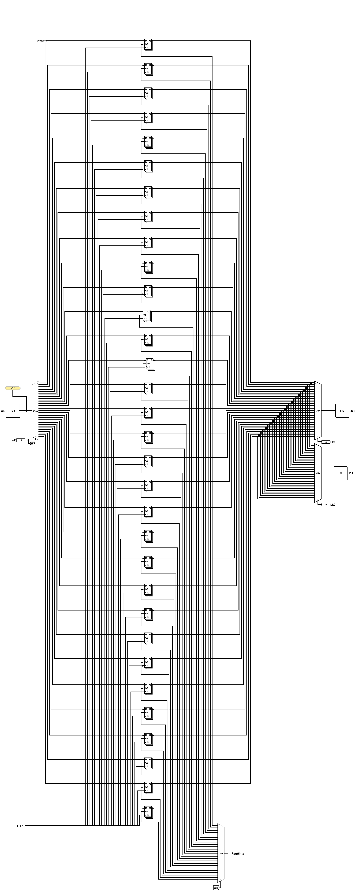

# Banco de Registradores

O Banco de Registradores é o componente que armazena os 32 registradores de uso geral (`x0` a `x31`) da arquitetura RISC-V, cada um com 32 bits. Ele disponibiliza **duas portas de leitura** independentes e assíncronas (para alimentar os operandos da ULA) e **uma porta de escrita** síncrona (controlada pelo clock), permitindo que o processador leia dois registradores e escreva em um terceiro dentro do mesmo ciclo.

 

## Interface

| Pino | Direção | Largura | Descrição |
| :--- | :---: | :---: | :--- |
| `LR1` | Entrada | 5 bits | Endereço do primeiro registrador a ser lido (*read register 1*). |
| `LR2` | Entrada | 5 bits | Endereço do segundo registrador a ser lido (*read register 2*). |
| `WR` | Entrada | 5 bits | Endereço do registrador de destino da escrita (*write register*). |
| `WD` | Entrada | 32 bits | Dado a ser escrito no registrador de destino (*write data*). |
| `RegWrite` | Entrada | 1 bit | Habilita a escrita (`1` para escrever, `0` para apenas ler). |
| `clk` | Entrada | 1 bit | Sinal de clock do sistema; sincroniza a porta de escrita. |
| `LD1` | Saída | 32 bits | Conteúdo do registrador endereçado por `LR1` (*read data 1*). |
| `LD2` | Saída | 32 bits | Conteúdo do registrador endereçado por `LR2` (*read data 2*). |

 

## Funcionamento

O banco opera com leituras combinacionais e escrita sincronizada pelo clock, da seguinte forma:

### 1. Leitura (assíncrona)
As duas portas de leitura são puramente combinacionais: o conteúdo de todos os 32 registradores está sempre disponível na entrada de dois **multiplexadores** de 32 bits. Cada multiplexador usa um endereço de leitura como seletor:
*   `LR1` seleciona qual registrador será encaminhado para a saída `LD1`.
*   `LR2` seleciona qual registrador será encaminhado para a saída `LD2`.

Como a leitura não depende do clock, os operandos ficam disponíveis imediatamente após a estabilização dos endereços.

 

### 2. Escrita (síncrona)
A escrita ocorre apenas na borda de subida do `clk` e somente quando `RegWrite = 1`. Para garantir que **apenas o registrador endereçado** seja modificado, o circuito utiliza o endereço `WR` como seletor de **dois demultiplexadores** simultâneos:
*   Um demultiplexador de **32 bits** roteia o dado `WD` até a entrada `D` do registrador de destino.
*   Um demultiplexador de **1 bit** roteia o sinal `RegWrite` até a entrada de habilitação de escrita (`WE`) desse mesmo registrador.

Dessa forma, na borda de clock, somente o registrador cuja entrada `WE` foi ativada captura o valor de `WD`; todos os demais permanecem com seu valor anterior.

> [!NOTE]
> O registrador `x0` é fixo em zero, conforme a especificação RISC-V. Qualquer leitura desse endereço retorna `0` e tentativas de escrita nele não têm efeito, pois seu valor é mantido constante.

 

## Implementação

O circuito é montado a partir dos seguintes blocos do Logisim:

- **Registradores:** 32 unidades de 32 bits, cada uma com entrada de dados `D`, saída `Q`, habilitação de escrita `WE` e *reset* `R`, todas sincronizadas pelo `clk`.
- **Demultiplexadores:** dois blocos com seletor de 5 bits (`WR`) — um de 32 bits, que direciona `WD` para o registrador correto, e um de 1 bit, que direciona o `RegWrite` para o `WE` correspondente.
- **Multiplexadores:** dois blocos de 32 bits com seletor de 5 bits (`LR1` e `LR2`), responsáveis por encaminhar o conteúdo dos registradores escolhidos para as saídas `LD1` e `LD2`.
- **Constante (`x0`):** uma constante de 32 bits com valor `0` é ligada à entrada `D` do registrador 0, fixando seu conteúdo em zero. Como a saída `Q` desse registrador alimenta a entrada `0` dos dois multiplexadores de leitura, qualquer leitura do endereço `0` retorna `0`.
- **Distribuição de clock:** o sinal `clk` é ramificado para todos os 32 registradores, garantindo que a escrita ocorra de forma síncrona em todo o banco.
