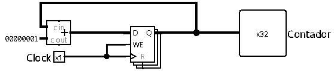

# Contador de Ciclos

O Contador de Ciclos é o componente responsável por registrar a quantidade total de ciclos de clock decorridos durante a execução de um programa no processador. Ele incrementa seu valor de forma combinacional e armazena o acumulado em um registrador sequencial.

 

## Interface

| Pino | Direção | Largura | Descrição |
| :--- | :---: | :---: | :--- |
| `Clock` | Entrada | 1 bit | Sinal de clock do sistema (gated pelo sinal de parada). |
| `Contador` | Saída | 32 bits | Valor acumulado de ciclos totais executados. |

 

## Funcionamento

O módulo atua como um acumulador simples em malha fechada. Em seu estado ativo, a cada borda de subida do sinal `Clock` recebido, o valor atual do contador é incrementado em `1` (`Contador = Contador + 1`).

### Mecanismo de parada
Embora o circuito interno do contador seja puramente um acumulador básico, o controle de congelamento da contagem é realizado de forma externa na unidade superior (`main.circ`). 

Para pausar a contagem quando o programa finaliza ou atinge uma condição de parada:
1. A unidade de controle principal (`ucPrincipal`) ativa o sinal **`Stop`** ao identificar uma instrução de parada ou opcode inválido.
2. Uma porta lógica AND externa realiza a operação `CLK & !Stop`.
3. Quando `Stop` é `1`, a saída da porta AND é forçada a `0`, congelando o sinal de clock que alimenta o registrador do contador. Isso impede novas atualizações e mantém o valor da contagem congelado no último estado.

 

## Implementação

Para a montagem deste circuito no Logisim, são utilizados blocos voltados para lógica sequencial e combinacional básica:

- **Somador:** circuito que soma continuamente a constante `1` ao valor atual do contador vindo do registrador.
*   **Registrador:** componente que armazena a contagem atualizada. Sua entrada `D` recebe o resultado do somador, e sua saída `Q` alimenta simultaneamente o próprio somador e o pino de saída `Contador`.