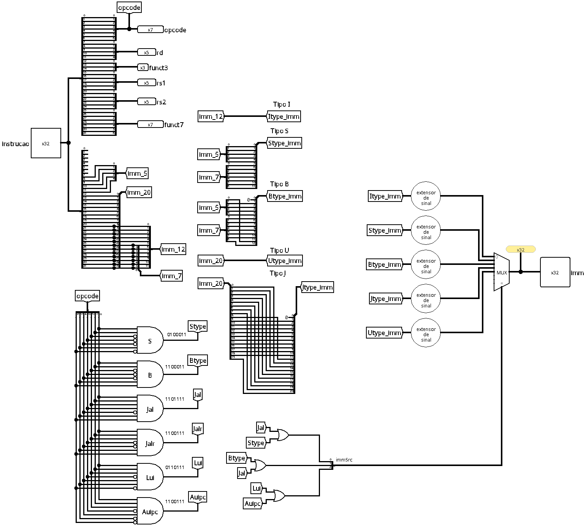

# Decodificador de Instruções

O decodificador de instruções é o componente combinacional encarregado de interpretar a instrução de 32 bits vinda da memória de instruções (`memInstr`), separando-a em seus campos constituintes e reconstruindo os imediatos necessários para a execução no *datapath*.

## Interface
| Pino | Direção | Largura | Descrição |
| --- | :---: | :---: | --- |
| `Instrucao` | Entrada | 32 bits | A instrução bruta lida da memória de instruções. |
| `opcode` | Saída | 7 bits | Bits `[6:0]`: identifica a categoria e o formato da instrução. |
| `rd` | Saída | 5 bits | Bits `[11:7]`: endereço do registrador de destino (onde o resultado será escrito). |
| `funct3` | Saída | 3 bits | Bits `[14:12]`: código auxiliar de 3 bits para identificar a operação. |
| `rs1` | Saída | 5 bits | Bits `[19:15]`: endereço do primeiro registrador fonte. |
| `rs2` | Saída | 5 bits | Bits `[24:20]`: endereço do segundo registrador fonte. |
| `funct7` | Saída | 7 bits | Bits `[31:25]`: código auxiliar de 7 bits para diferenciação fina de operações. |
| `Imm` | Saída | 32 bits | O valor imediato final, reconstruído e estendido para 32 bits. |

 

## Funcionamento
O circuito atua de forma totalmente combinacional, sendo dividido em três grandes blocos de responsabilidade:

### 1. Fatiamento
Devido à arquitetura RISC-V, os campos dos registradores (`rs1`, `rs2` e `rd`) e os códigos de operação (`opcode`, `funct3` e `funct7`) estão sempre localizados nos mesmos índices de bits, independentemente da instrução. O decodificador utiliza de distribuidores para rotear essas vias diretamente para as saídas, considerando os bits descritos acima.

 

### 2. Reconstrução e extensão dos imediatos
Cada formato de instrução posiciona os bits do imediato em locais distintos, por isso, o decodificador reconstrói o imediato de cada formato aplicando a extensão apropriada:

| Formato | Bits da instrução | Tratamento e alinhamento | Extensor |
| :---: | :--- | :--- | :---: |
| **Tipo I** | `[31:20]` | Extensão de sinal direta de 12 para 32 bits. | `extensorSinal_12` |
| **Tipo S** | `[31:25]`, `[11:7]` | Extensão de sinal direta de 12 para 32 bits. | `extensorSinal_12` |
| **Tipo B** | `[31]`, `[7]`, `[30:25]`, `[11:8]` | Extensão de sinal para 13 bits (bit 0 implícito em `0` para alinhamento de 2 bytes). | `extensorSinal_13` |
| **Tipo U** | `[31:12]` | Mantém os 20 bits na parte superior e preenche os 12 bits inferiores com `0`. | `extensorZero_20_typeU` |
| **Tipo J** | `[31]`, `[19:12]`, `[20]`, `[30:21]` | Extensão de sinal para 21 bits (bit 0 implícito em `0` para alinhamento de 2 bytes). | `extensorSinal_21` |

> [!NOTE]
> Para os formatos de salto (**Tipo B** e **Tipo J**), o bit menos significativo (bit 0) é omitido na instrução e assumido como `0`, pois os endereços das instruções na memória são sempre alinhados em meia-palavra (2 bytes) ou palavra inteira (4 bytes).

 

### 3. O sinal `immSrc`

O controle do imediato é feito pelo sinal **`immSrc`** de 3 bits, que atua como seletor do multiplexador final de imediatos.

#### Geração do `immSrc`
A partir do `opcode`, portas lógicas combinadas com inversores ativam chaves de controle internas para os formatos específicos:

| Sinal Interno | Opcode | Significado / Categoria |
| :--- | :---: | :--- |
| `Stype` | `0100011` | Escrita em memória (ex: `sw`) |
| `Btype` | `1100011` | Desvio condicional (ex: `beq`, `bne`) |
| `Jal` | `1101111` | Salto incondicional relativo (`jal`) |
| `Jalr` | `1100111` | Salto incondicional indireto (`jalr`) |
| `Lui` | `0110111` | Carregar imediato superior (`lui`) |
| `Auipc` | `0010111` | Somar imediato superior ao PC (`auipc`) |

Os sinais acima são processados por portas OR e agrupados por um distribuidor para formar o barramento de 3 bits do `immSrc` `[bit2, bit1, bit0]`:
*   **`bit0`** = `Jal | Stype`
*   **`bit1`** = `Btype | Jal`
*   **`bit2`** = `Lui | Auipc`

 

#### Mapeamento de seleção do multiplexador
A tabela abaixo mostra a relação entre o valor lógico de `immSrc` e a saída de imediato selecionada:

| `immSrc` | Formato selecionado | Entrada do Mux | Comportamento |
| :---: | :---: | :---: | :--- |
| **`000`** | **Tipo I** / **Jalr** | Entrada 0 | Padrão para instruções aritméticas/lógicas imediatas e de leitura de memória (`addi`, `lw`), além da instrução de salto `jalr` (que utiliza um imediato no mesmo formato do tipo I). |
| **`001`** | **Tipo S** | Entrada 1 | Seleciona o imediato reconstruído para gravação em memória (`sw`). |
| **`010`** | **Tipo B** | Entrada 2 | Seleciona o imediato reconstruído para desvios (`beq`, `bne`). |
| **`011`** | **Tipo J** | Entrada 3 | Seleciona o imediato reconstruído para saltos longos (`jal`). |
| **`100`** | **Tipo U** | Entrada 4 | Seleciona o imediato de 20 bits deslocado para cima (`lui`, `auipc`). |
| `101` a `111` | *Reservado* | Entradas 5 a 7 | Combinações não utilizadas na arquitetura RISC-V básica. |

 

## Implementação
O circuito faz uso dos seguintes blocos estruturais do Logisim:
- **Distribuidores:** usados tanto para segmentar a instrução bruta de entrada quanto para recombinar os bits espalhados dos imediatos dos formatos S, B, J e U.
- **Portas lógicas (AND, NOT, OR):** responsáveis por decodificar o `opcode` de 7 bits e mapear os sinais internos para gerar o seletor `immSrc`.
- **Multiplexador de dados:** módulo orientado pelo `immSrc` que encaminha o imediato correto para a saída `Imm`.