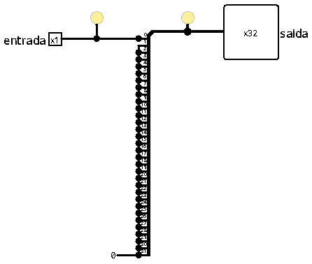
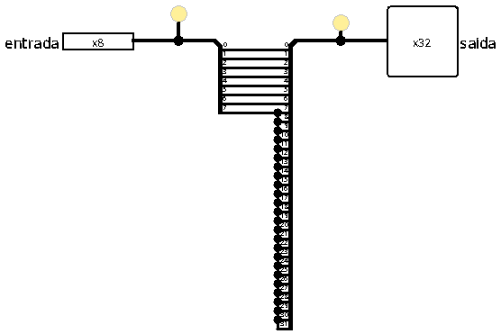
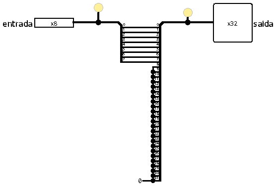
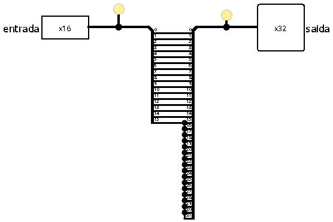
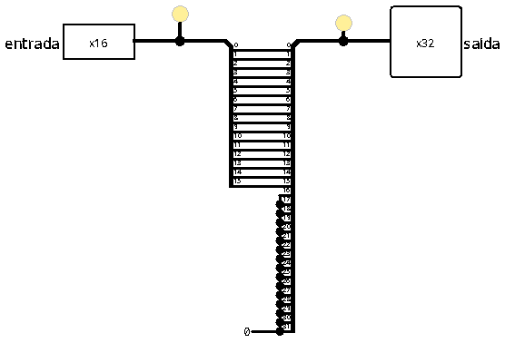
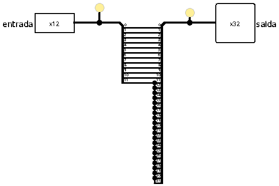
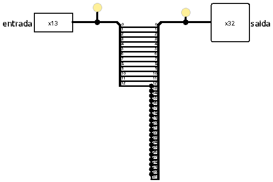
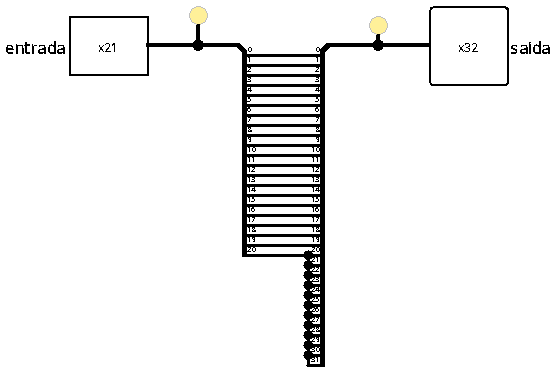
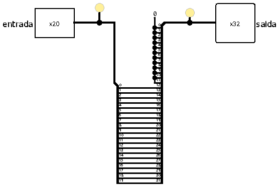

# Extensores de sinal e de zero

Em uma arquitetura de 32 bits (como a do RISC-V), os registradores internos e a Unidade Lógica e Aritmética (ULA) operam exclusivamente com barramentos de dados de 32 bits. No entanto, muitas instruções contêm valores imediatos menores (de 1, 12, 13, 20 ou 21 bits) ou manipulam dados vindos da memória em porções menores (bytes de 8 bits ou meias-palavras de 16 bits).

Os **Extensores de Sinal e de Zero** são os blocos responsáveis por compatibilizar essas larguras de dados menores, expandindo-as para o formato padrão de 32 bits antes que o dado entre na ULA ou seja escrito em um registrador.

 

## Conceitos Fundamentais

Para compreender e replicar estes circuitos, é crucial diferenciar os dois tipos de extensão aritmética:

### 1. Extensão de Sinal (*Sign Extension*)
Utilizada para números inteiros sinalizados (representados em complemento de 2). O circuito identifica o bit mais significativo (MSB) do dado de entrada, que indica o sinal do número (0 para positivo, 1 para negativo), e o replica por todas as novas posições à esquerda até completar 32 bits. Isso garante que o valor numérico e o seu sinal original sejam matematicamente preservados.

**Exemplo (4 bits para 8 bits):**
*   **Positivo:** `0101` (5) $\rightarrow$ O bit de sinal é `0` $\rightarrow$ Estende para `00000101` (5).
*   **Negativo:** `1101` (-3) $\rightarrow$ O bit de sinal é `1` $\rightarrow$ Estende para `11111101` (-3).

 

### 2. Extensão de Zero (*Zero Extension*)
Utilizada para valores não sinalizados (*unsigned*) ou lógicos. O circuito ignora o sinal do dado de entrada e simplesmente preenche todas as novas posições à esquerda com o nível lógico baixo (`0`). 

**Exemplo (4 bits para 8 bits):**
*   **Valor:** `1101` (13 em decimal não sinalizado) $\rightarrow$ Estende para `00001101` (13).

 

## Tabela resumo dos módulos

Todos os extensores abaixo estão implementados no arquivo `extensoresSinal.circ`. A tabela a seguir descreve cada módulo, sua largura e sua aplicação:

| Módulo | Entrada | Saída | Tipo de Extensão | Aplicação Principal |
| :--- | :---: | :---: | :---: | :--- |
| `extensorSinal_1` | 1 bit | 32 bits | Sinal (MSB) | Converte *flags* lógicas em dados de 32 bits para gravação em registrador (`slt`). |
| `extensorSinal_8` | 8 bits | 32 bits | Sinal (MSB) | Extensão de sinal para leitura de byte (`lb`). |
| `extensorZero_8` | 8 bits | 32 bits | Zero (`0`) | Extensão de zero para leitura de byte não sinalizado (`lbu`). |
| `extensorSinal_12` | 12 bits | 32 bits | Sinal (MSB) | Extensão de imediatos de Tipo I (`addi`, `lw`, `jalr`) e Tipo S (`sw`). |
| `extensorSinal_13` | 13 bits | 32 bits | Sinal (MSB) | Extensão de imediatos de desvios condicionais Tipo B (`beq`, `bne`). |
| `extensorSinal_16` | 16 bits | 32 bits | Sinal (MSB) | Extensão de sinal para leitura de meia-palavra (`lh`). |
| `extensorZero_16` | 16 bits | 32 bits | Zero (`0`) | Extensão de zero para leitura de meia-palavra não sinalizada (`lhu`). |
| `extensorZero_20_typeU` | 20 bits | 32 bits | Alinhamento Superior | Posiciona o imediato do Tipo U nos 20 bits superiores e preenche os 12 bits inferiores com `0` (`lui`, `auipc`). |
| `extensorSinal_21` | 21 bits | 32 bits | Sinal (MSB) | Extensão de imediatos de saltos incondicionais Tipo J (`jal`). |

 

## Interface e funcionamento

Todos os componentes seguem o mesmo princípio: a via de entrada é fatiada por um distribuidor, e as vias de saída de 32 bits são ligadas de modo que as posições inferiores recebam o dado original e as posições superiores recebam ou o bit mais significativo do dado (extensão de sinal) ou uma constante zero (extensão de zero).

### 1. Extensor de sinal de 1 bit (`extensorSinal_1`)
Converte o bit único de entrada em 32 bits idênticos na saída (ou todos `0` ou todos `1`).

 

### 2. Extensores de dados de memória (`extensorSinal_8`, `extensorZero_8`, `extensorSinal_16`, `extensorZero_16`)
Usados nas instruções de leitura (*load*) de dados da memória com larguras de 8 bits (byte) ou 16 bits (half-word).
*   **Com extensão de sinal:** replicam o bit de sinal do dado original (`bit 7` no caso de 8 bits e `bit 15` no caso de 16 bits) para manter a representação correta de valores negativos.
*   **Com extensão de zero:** Preenchem os bits superiores restantes com `0`, ignorando qualquer sinal.

| Extensor de Sinal (8 e 16 bits) | Extensor de Zero (8 e 16 bits) |
| :---: | :---: |
|  |  |
|  |  |

 

### 3. Extensores de imediatos do decodificador (`extensorSinal_12`, `extensorSinal_13`, `extensorSinal_21`)
Utilizados no decodificador para formar os imediatos de 32 bits:
*   **`extensorSinal_12`:** estende a entrada de 12 bits para 32 bits replicando o `bit 11`.
*   **`extensorSinal_13` (Tipo B):** recebe o imediato de 13 bits (cujo `bit 0` já foi preenchido com `0` na reconstrução) e replica o `bit 12`.
*   **`extensorSinal_21` (Tipo J):** recebe o imediato de 21 bits (cujo `bit 0` já foi preenchido com `0` na reconstrução) e replica o `bit 20`.

| Extensor de Sinal de 12 bits | Extensor de Sinal de 13 bits | Extensor de Sinal de 21 bits |
| :---: | :---: | :---: |
|  |  |  |

 

### 4. Extensor de alinhamento superior (`extensorZero_20_typeU`)
Este extensor é exclusivo para instruções do Tipo U (`lui` e `auipc`). Em vez de estender bits à esquerda (posições mais significativas), ele insere **12 bits zero à direita** (posições menos significativas `[11:0]`), empurrando a entrada de 20 bits para a parte superior da palavra de 32 bits (`[31:12]`).

 

## Implementação
Os circuitos fazem uso dos seguintes blocos estruturais do Logisim:
- **Distribuidores:** usados tanto para segmentar os bits do barramento de entrada quanto para expandi-los e conectá-los nas posições de saída do barramento de 32 bits.
- **Constantes:** utilizadas para injetar o nível lógico baixo (`0`) nas posições não ocupadas nos extensores de zero e de alinhamento superior (Tipo U).