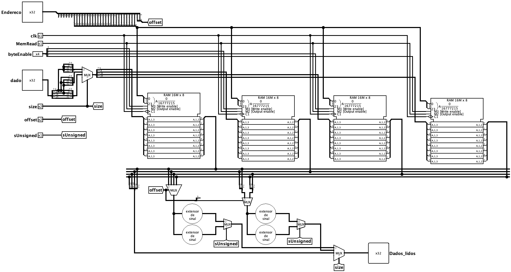

# Memória de Dados

A Memória de Dados é o componente que armazena e recupera os dados manipulados pelo programa durante a execução (a região de *load*/*store* do processador). Ela é acessada pelas instruções de leitura (`lw`, `lh`, `lb`, `lhu`, `lbu`) e de escrita (`sw`, `sh`, `sb`), oferecendo suporte a acessos de **palavra (32 bits)**, **meia-palavra (16 bits)** e **byte (8 bits)**, tanto com sinal quanto sem sinal.

Para permitir o acesso com diferentes granularidades, a memória é organizada em **quatro bancos de 8 bits** (um por byte da palavra), o que possibilita escrever apenas os bytes desejados sem alterar os demais.

 

## Interface

| Pino | Direção | Largura | Descrição |
| :--- | :---: | :---: | :--- |
| `Endereco` | Entrada | 32 bits | Endereço de memória a ser acessado (leitura ou escrita). |
| `dado` | Entrada | 32 bits | Dado a ser gravado nas instruções de escrita (*store*). |
| `MemRead` | Entrada | 1 bit | Habilita a leitura da memória (*output enable*). |
| `byteEnable` | Entrada | 4 bits | Seleciona quais dos quatro bancos de byte serão escritos, permitindo `sb`, `sh` e `sw`. |
| `size` | Entrada | 2 bits | Tamanho do acesso: byte, meia-palavra ou palavra. |
| `offset` | Entrada | 2 bits | Deslocamento do dado dentro da palavra (qual byte/meia-palavra está sendo acessado). |
| `sUnsigned` | Entrada | 1 bit | Define a extensão da leitura (`0` para extensão de sinal, `1` para extensão de zero). |
| `clk` | Entrada | 1 bit | Sinal de clock que sincroniza a escrita na memória. |
| `Dados_lidos` | Saída | 32 bits | Dado lido da memória, já alinhado e estendido para 32 bits. |

 

## Funcionamento

O circuito separa o acesso em duas operações: a escrita, síncrona com o clock, e a leitura, combinacional. O endereço de entrada é fatiado para fornecer tanto o endereço de palavra enviado aos bancos quanto o `offset` de byte dentro dela.

### 1. Escrita (*store*)
Para gravar dados, o circuito utiliza a entrada `dado` e os controles `byteEnable`, `offset` e `clk`:
*   O dado de 32 bits é distribuído para os quatro bancos de byte; um multiplexador controlado por `size` ajusta o padrão de bytes encaminhado conforme o tamanho do acesso.
*   O sinal `byteEnable` (4 bits) — já alinhado pelo `offset` na unidade de controle de endereçamento — ativa individualmente o *write enable* de cada um dos quatro bancos de byte. Assim, `sb` habilita apenas um banco, `sh` habilita dois e `sw` habilita os quatro, fazendo o dado cair na posição correta da palavra.
*   A gravação efetiva ocorre na borda de clock, apenas nos bancos habilitados; os demais mantêm seu conteúdo anterior.

 

### 2. Leitura (*load*)
A leitura é combinacional e habilitada por `MemRead`. Os quatro bancos entregam seus bytes simultaneamente, e o circuito monta a saída em três etapas:
*   **Seleção do trecho:** com base no `offset`, multiplexadores escolhem qual byte ou meia-palavra da palavra lida será usado.
*   **Extensão:** o trecho selecionado passa pelos extensores apropriados (`extensorSinal_8`/`extensorSinal_16` para valores com sinal e `extensorZero_8`/`extensorZero_16` para valores sem sinal). O sinal `sUnsigned` seleciona, em cada par, qual extensão é encaminhada.
*   **Seleção do tamanho:** por fim, um multiplexador controlado por `size` escolhe entre o resultado de byte, de meia-palavra ou da palavra completa, entregando o valor final em `Dados_lidos`.

> [!NOTE]
> A distinção entre extensão de sinal e de zero é o que diferencia, por exemplo, `lb` de `lbu` e `lh` de `lhu`. Com `sUnsigned = 0`, o bit mais significativo do dado é replicado (preservando valores negativos); com `sUnsigned = 1`, as posições superiores são preenchidas com `0`.

 

## Implementação

O circuito é montado a partir dos seguintes blocos do Logisim:

- **Memórias RAM:** quatro blocos `RAM 16M x 8` (8 bits de dado, 24 bits de endereço, gravação na borda de descida do clock), cada um representando um banco de byte da palavra de 32 bits.
- **Distribuidores (*splitters*):** fatiam o endereço de entrada (separando o endereço de palavra do `offset`) e quebram/recombinam o dado de 32 bits em seus quatro bytes individuais.
- **Multiplexadores:** alinham o dado de escrita conforme o `offset` e, na leitura, selecionam o trecho correto (`offset`), a extensão desejada (`sUnsigned`) e o tamanho final do acesso (`size`).
- **Extensores:** módulos `extensorSinal_8`, `extensorZero_8`, `extensorSinal_16` e `extensorZero_16`, importados de `../Extensores/extensoresSinal.circ`, responsáveis por expandir bytes e meias-palavras para 32 bits.
