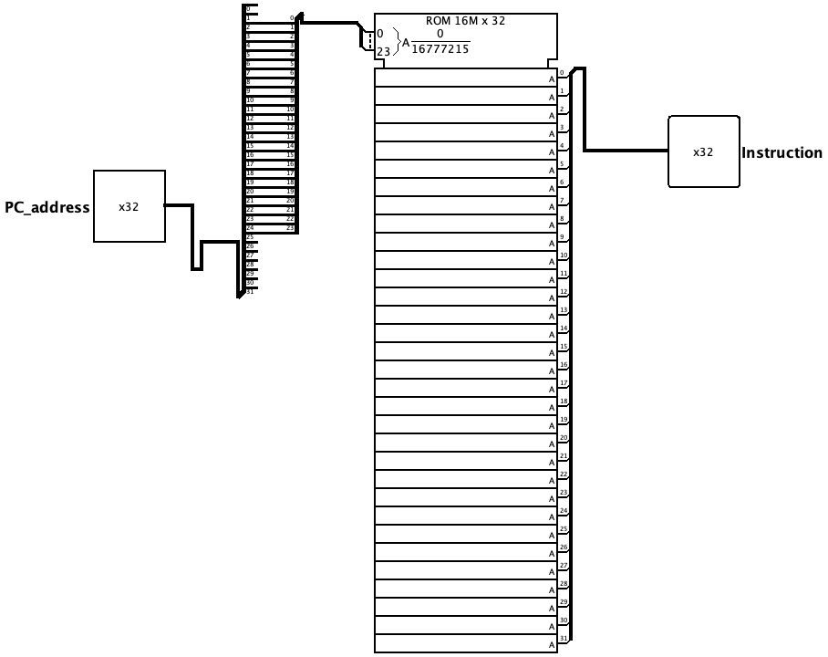

# Memória de Instruções

A Memória de Instruções é o componente que armazena o programa a ser executado pelo processador. A cada ciclo, ela recebe o endereço da próxima instrução vindo do contador de programa (`PC_address`) e devolve a instrução de 32 bits correspondente (`Instruction`), que será interpretada pelo decodificador e pela unidade de controle.

Por ser uma memória somente de leitura (*ROM*), seu conteúdo é fixo durante a execução: o circuito apenas consulta a posição endereçada, sem nunca escrever sobre ela.

 

## Interface

| Pino | Direção | Largura | Descrição |
| :--- | :---: | :---: | :--- |
| `PC_address` | Entrada | 32 bits | Endereço da instrução a ser buscada, fornecido pelo contador de programa (PC). |
| `Instruction` | Saída | 32 bits | Instrução de 32 bits armazenada na posição endereçada. |

 

## Funcionamento

O circuito atua de forma puramente combinacional: dado um endereço estável em `PC_address`, a instrução correspondente aparece imediatamente em `Instruction`.

### 1. Alinhamento do endereço
Como cada instrução ocupa uma palavra de 4 bytes, os endereços de instrução são sempre múltiplos de 4. Por isso, o circuito descarta os 2 bits menos significativos do `PC_address` e usa os 24 bits seguintes como endereço de palavra da ROM. Essa conversão (divisão por 4) faz com que avançar o PC em 4 bytes corresponda a avançar exatamente uma posição na memória.

 

### 2. Leitura da instrução
O endereço de 24 bits seleciona uma das posições da ROM, cujo conteúdo de 32 bits é encaminhado diretamente para a saída `Instruction`. Não há controle de escrita nem sinal de habilitação: a leitura está sempre ativa.

> [!NOTE]
> O conteúdo da ROM representa o programa em linguagem de máquina. Ele é carregado previamente na memória (em hexadecimal) e permanece fixo durante toda a simulação, já que esta é a memória de **somente leitura** do processador.

 

## Implementação

O circuito é montado a partir dos seguintes blocos do Logisim:

- **Memória ROM:** bloco `ROM 16M x 32` (endereço de 24 bits e dado de 32 bits), que armazena as instruções do programa e entrega a palavra endereçada na saída.
- **Distribuidor (*splitter*):** fatia o `PC_address` de 32 bits, descartando os 2 bits menos significativos e roteando os 24 bits de endereço de palavra para a entrada da ROM.
