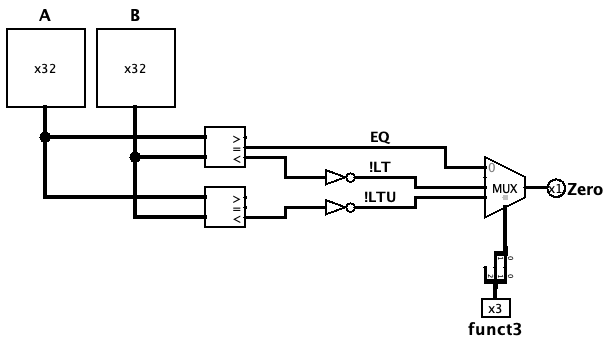

# Mini-ULA de Desvio (idULA)

A Mini-ULA de Desvio (`idULA`) é o componente responsável por realizar, no estágio de *Instruction Decode* (ID), as comparações necessárias para a tomada de decisão dos desvios condicionais (*branches*). Ao operar diretamente sobre os valores de saída do banco de registradores (`rs1` e `rs2`), ela antecipa a resolução do desvio para o ID, **reduzindo conflitos e bolhas** no pipeline.

Ela assume, apenas para os desvios, o papel que antes era desempenhado pela dupla `ucULA` + `ULA` no estágio de execução (EX). Por isso, ela **não** realiza aritmética de resultado (soma, subtração, deslocamentos): faz somente **comparações**, entregando uma única saída `Zero` compatível com a `ucDesvio` já existente.

 

## Interface

| Pino | Direção | Largura | Descrição |
| :--- | :---: | :---: | :--- |
| `A` | Entrada | 32 bits | Primeiro operando (`rs1`, vindo do banco de registradores). |
| `B` | Entrada | 32 bits | Segundo operando (`rs2`; desvios são Tipo-B, nunca imediato). |
| `funct3` | Entrada | 3 bits | Campo da instrução; seleciona qual comparação alimenta o `Zero`. |
| `Zero` | Saída | 1 bit | Resultado da comparação selecionada, entregue diretamente à `ucDesvio`. |

 

## Tabela de comparações por instrução

A tabela abaixo mostra qual comparação primitiva cada desvio usa e como o sinal atravessa a `idULA` e a `ucDesvio` até a decisão final:

| Instr | Conceito (taken quando) | Mux recebe | `ucDesvio` aplica | Resultado final |
| :--- | :--- | :---: | :--- | :--- |
| **beq**  | `EQ=1`  | `EQ`   | direto | `EQ` |
| **bne**  | `EQ=0`  | `EQ`   | NOT    | `!EQ` |
| **blt**  | `LT=1`  | `!LT`  | NOT    | `!(!LT) = LT` |
| **bge**  | `LT=0`  | `!LT`  | direto | `!LT` |
| **bltu** | `LTU=1` | `!LTU` | NOT    | `!(!LTU) = LTU` |
| **bgeu** | `LTU=0` | `!LTU` | direto | `!LTU` |

> O `EQ` entra **direto** no mux, mas o `LT` e o `LTU` entram **negados**. Isso reproduz a convenção que a `ucDesvio` já espera (herdada da ULA antiga, onde o `Zero` da comparação `slt` significava "não é menor"). A dupla negação — `!LT` no mux e a bolha `NOT` na `ucDesvio` — se cancela, resultando no comportamento correto.

 

## Tabela de seleção do mux (`funct3`)

O seletor do multiplexador é montado com os bits `funct3[2]` (bit alto) e `funct3[1]` (bit baixo):

| Instr | `funct3` | `funct3[2]` | `funct3[1]` | Seletor | Entrada do mux | `Zero` sai = |
| :--- | :---: | :---: | :---: | :---: | :---: | :---: |
| **beq**  | `000` | 0 | 0 | `00` | 0 | `EQ` |
| **bne**  | `001` | 0 | 0 | `00` | 0 | `EQ` |
| **blt**  | `100` | 1 | 0 | `10` | 2 | `!LT` |
| **bge**  | `101` | 1 | 0 | `10` | 2 | `!LT` |
| **bltu** | `110` | 1 | 1 | `11` | 3 | `!LTU` |
| **bgeu** | `111` | 1 | 1 | `11` | 3 | `!LTU` |

> O `funct3[0]` **não** entra no mux — ele é o bit que diferencia cada par (beq/bne, blt/bge, bltu/bgeu) e é usado apenas pela `ucDesvio` para inverter a polaridade. Por isso a entrada `1` do mux (seletor `01`) nunca é selecionada: não existe desvio com `funct3[2:1] = 01`.

 

## Funcionamento

A `idULA` é **puramente combinacional** e opera em quatro etapas a cada instrução que passa pelo ID:

### 1. Entrada dos operandos
O banco de registradores entrega `rs1` e `rs2`, que alimentam simultaneamente os dois comparadores (nas entradas `A` e `B`).

### 2. Comparação contínua
Os comparadores calculam **todas** as respostas o tempo todo, independentemente da instrução:
*   `EQ`  — `rs1 == rs2`
*   `LT`  — `rs1 < rs2` (com sinal)
*   `LTU` — `rs1 < rs2` (sem sinal)

### 3. Seleção pelo `funct3`
O multiplexador, controlado por `funct3[2:1]`, escolhe qual comparação (`EQ`, `!LT` ou `!LTU`) se torna a saída `Zero`. As demais são ignoradas naquele ciclo.

### 4. Decisão do desvio
A saída `Zero` é entregue à `ucDesvio`, que — sem qualquer alteração — aplica a polaridade pelo `funct3[0]` e produz o `BranchSrc`.

> A distinção **com sinal** × **sem sinal** é essencial: para operandos negativos, `LT` e `LTU` divergem (ex.: `-1` é o menor valor com sinal, mas o maior sem sinal). Por isso os **dois** comparadores são necessários; a igualdade (`EQ`), por ser idêntica nos dois modos, é retirada de apenas um.

 

## Implementação

A `idULA` é construída pelos seguintes blocos:

- **Comparador com sinal** (`2's Complement`, 32 bits) — fornece `EQ` (saída `=`) e `LT` (saída `<`).
- **Comparador sem sinal** (`Unsigned`, 32 bits) — fornece `LTU` (saída `<`); suas saídas `=` e `>` não são usadas.
- **Inversores (`NOT`)** — aplicados às linhas `LT` e `LTU` antes do mux, gerando `!LT` e `!LTU`.
- **Multiplexador 4→1** — seletor de 2 bits (`funct3[2]`, `funct3[1]`); entradas `0 = EQ`, `2 = !LT`, `3 = !LTU`; a entrada `1` é aterrada em `0` (nunca selecionada).
- **Splitter** — separa o `funct3` de 3 bits para montar o seletor do mux.

> [!NOTE]
> Com a igualdade (`EQ`) resolvida pela `idULA`, a **ULA principal do EX não precisa mais da saída `sZero`** nem do subcomponente `zero`.
