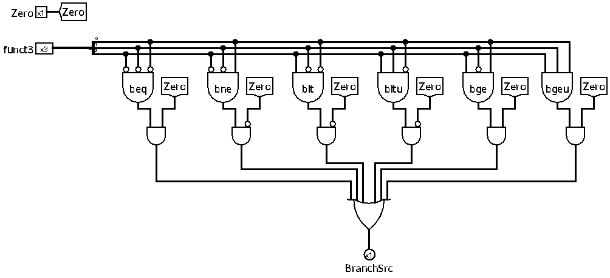

# Unidade de Controle de Desvio

A Unidade de Controle de Desvio (`ucDesvio`) é o componente encarregado de avaliar se as condições de desvios condicionais (*branches*) foram satisfeitas. Ela analisa a flag de comparação gerada pela ULA e o campo `funct3` da instrução, determinando se o fluxo do programa deve realizar o salto condicional.

 

## Interface

| Pino | Direção | Largura | Descrição |
| :--- | :---: | :---: | :--- |
| `Zero` | Entrada | 1 bit | Sinalizador de igualdade/comparação oriundo da ULA. |
| `funct3` | Entrada | 3 bits | Campo da instrução que identifica o tipo de comparação do desvio. |
| `BranchSrc` | Saída | 1 bit | Indica se a condição do desvio foi atendida (`1`) ou não (`0`). |

 

## Tabela de mapeamento de condições

A tabela abaixo descreve como o campo `funct3` é decodificado para verificar a respectiva condição através do sinal `Zero` gerado pela ULA:

| funct3 | Instrução | Comparação | Condição do desvio |
| :---: | :--- | :---: | :---: |
| `000` | `beq` (Branch Equal) | `A == B` (via subtração) | `Zero == 1` |
| `001` | `bne` (Branch Not Equal) | `A != B` (via subtração) | `Zero == 0` |
| `100` | `blt` (Branch Less Than) | `A < B` (com sinal) | `Zero == 0` |
| `101` | `bge` (Branch Greater or Equal) | `A >= B` (com sinal) | `Zero == 1` |
| `110` | `bltu` (Branch Less Than *Unsigned*) | `A < B` (sem sinal) | `Zero == 0` |
| `111` | `bgeu` (Branch Greater or Equal *Unsigned*) | `A >= B` (sem sinal) | `Zero == 1` |

 

## Funcionamento

A unidade de desvio não realiza cálculos matemáticos diretamente. Em vez disso, ela atua sob os resultados das operações preparadas previamente pela unidade de controle da ULA para executar na ULA. 

### Lógica de comparação por subtração (`beq` / `bne`)
Para verificar igualdade ou diferença, a ULA realiza a operação de subtração (`A - B`).
*   **`beq`:** Se `A - B == 0`, a flag `Zero` da ULA se torna `1`. O desvio deve ocorrer, logo `BranchSrc = 1`.
*   **`bne`:** Se `A - B != 0`, a flag `Zero` da ULA permanece em `0`. O desvio deve ocorrer, logo `BranchSrc = 1`.

### Lógica de comparação menor-que (`blt` / `bge` / `bltu` / `bgeu`)
Para desvios baseados em menor-que ou maior-ou-igual, a ULA executa a operação de comparação *Set Less Than* (`slt` ou `sltu`). 
*   Se a condição `A < B` for **verdadeira**, a ULA emite o resultado de 32 bits `1` (diferente de zero), fazendo com que a flag `Zero` seja `0`.
*   Se a condição `A < B` for **falsa** (o que implica `A >= B`), a ULA emite o resultado `0` (igual a zero), ativando a flag `Zero` para `1`.

Dessa forma:
*   **`blt` / `bltu`:** Branch se menor-que. Ocorre quando a comparação é verdadeira, ou seja, `Zero == 0`.
*   **`bge` / `bgeu`:** Branch se maior ou igual. Ocorre quando a comparação é falsa, ou seja, `Zero == 1`.

 

## Implementação

A unidade é composta por lógica estritamente combinacional, e pelos seguintes blocos:

- **Decodificadores / portas lógicas:** identificam cada um dos 6 padrões de `funct3`.
- **Portas de validação condicional:** combinam a identificação do `funct3` correspondente com o sinal `Zero` (de forma direta ou invertida por portas NOT).
- **Porta OR final:** consolida os 6 caminhos de comparação. Se qualquer uma das condições decodificadas for satisfeita, o pino de saída `BranchSrc` é definido para `1`.