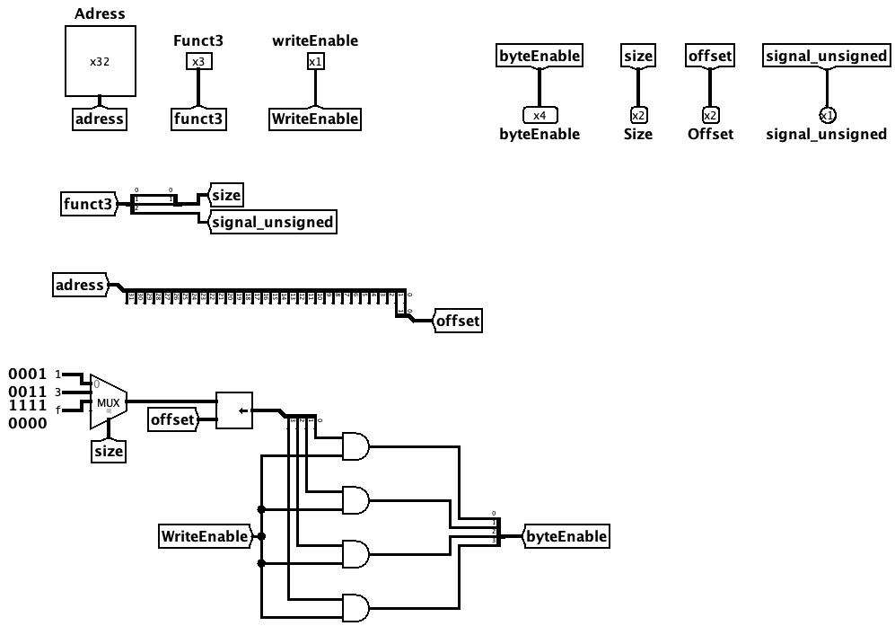

# Unidade de Controle de Endereçamento

A Unidade de Controle de Endereçamento é o componente combinacional que prepara os sinais de controle de acesso à **Memória de Dados**. A partir do campo `Funct3` da instrução, do endereço calculado pela ULA (`Adress`) e do sinal `writeEnable`, ela determina o tamanho do acesso, o alinhamento do dado, o tipo de extensão e quais bytes devem ser escritos.

Em outras palavras, é ela quem traduz as instruções de *load* e *store* (`lb`, `lh`, `lw`, `lbu`, `lhu`, `sb`, `sh`, `sw`) nos sinais `Size`, `Offset`, `signal_unsigned` e `byteEnable` que a memória precisa.

 

## Interface

| Pino | Direção | Largura | Descrição |
| :--- | :---: | :---: | :--- |
| `Adress` | Entrada | 32 bits | Endereço de memória calculado pela ULA. |
| `Funct3` | Entrada | 3 bits | Campo da instrução que define o tipo de acesso (tamanho e sinal). |
| `writeEnable` | Entrada | 1 bit | Indica se a operação é uma escrita (`1` para *store*, `0` para *load*). |
| `Size` | Saída | 2 bits | Tamanho do acesso: byte, meia-palavra ou palavra. |
| `Offset` | Saída | 2 bits | Deslocamento do dado dentro da palavra (2 bits menos significativos do endereço). |
| `signal_unsigned` | Saída | 1 bit | Define a extensão na leitura (`0` para sinal, `1` para zero). |
| `byteEnable` | Saída | 4 bits | Máscara que indica quais dos quatro bytes da palavra serão escritos. |

 

## Funcionamento

O circuito deriva todos os sinais de saída de forma combinacional, organizados em três caminhos independentes:

### 1. Decodificação do `Funct3`
O campo `Funct3` carrega, ao mesmo tempo, o tamanho e a "sinalização" do acesso. Um distribuidor o separa em:
*   **`Size`** — os 2 bits menos significativos (`Funct3[1:0]`), que codificam byte (`00`), meia-palavra (`01`) ou palavra (`10`).
*   **`signal_unsigned`** — o bit mais significativo (`Funct3[2]`), que diferencia as versões com sinal das sem sinal (por exemplo, `lb` de `lbu` e `lh` de `lhu`).

 

### 2. Extração do `Offset`
Como a memória é endereçada por byte mas organizada em palavras de 4 bytes, os 2 bits menos significativos do `Adress` indicam a posição do byte dentro da palavra. Um distribuidor extrai `Adress[1:0]` e os encaminha diretamente para a saída `Offset`.

 

### 3. Geração do `byteEnable`
A máscara de escrita é construída em três etapas:
*   **Máscara base:** um multiplexador, controlado por `Size`, seleciona o padrão de bytes correspondente ao tamanho do acesso — `0001` (byte), `0011` (meia-palavra) ou `1111` (palavra).
*   **Alinhamento:** um deslocador (*shifter*) desloca essa máscara para a esquerda de acordo com o `Offset`, posicionando os bits ativos sobre os bytes corretos da palavra.
*   **Habilitação:** por fim, cada bit da máscara passa por uma porta `AND` com o sinal `writeEnable`. Assim, o `byteEnable` só fica ativo durante uma escrita; em leituras (`writeEnable = 0`), a máscara resultante é `0000`, evitando qualquer gravação acidental.

> [!NOTE]
> A combinação de máscara base + deslocamento por `Offset` é o que permite que uma instrução como `sb` grave apenas um byte específico da palavra (por exemplo, o terceiro byte com `Offset = 10` resulta em `byteEnable = 0100`), sem sobrescrever os bytes vizinhos.

 

## Implementação

O circuito é montado a partir dos seguintes blocos do Logisim:

- **Distribuidores (*splitters*):** separam o `Funct3` em `Size` e `signal_unsigned` e extraem o `Offset` dos bits menos significativos do `Adress`.
- **Multiplexador:** seletor de `Size` (2 bits) que escolhe a máscara base de bytes a partir de três constantes (`0001` para byte, `0011` para meia-palavra e `1111` para palavra).
- **Deslocador (*shifter*):** desloca a máscara base para a esquerda conforme o `Offset`, alinhando-a à posição correta.
- **Portas lógicas (AND):** quatro portas que combinam cada bit da máscara deslocada com o `writeEnable`, produzindo o `byteEnable` final apenas em operações de escrita.
- **Constantes:** valores fixos das máscaras de byte usados como entradas do multiplexador.
