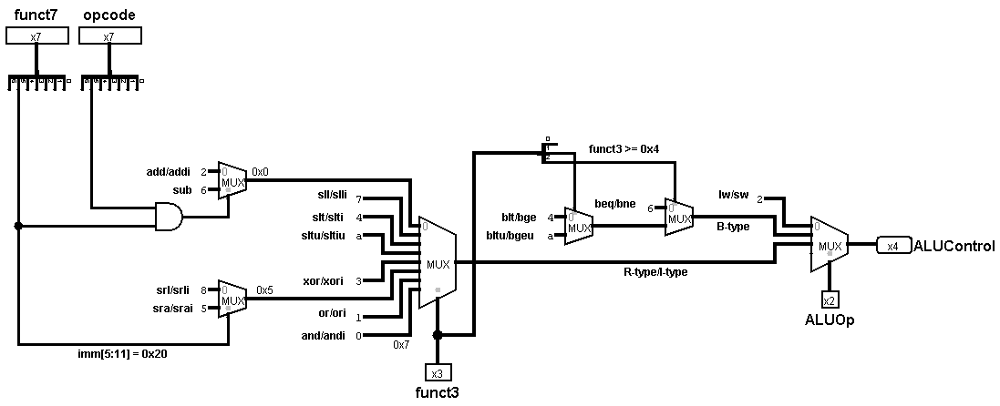

# Unidade de Controle da ULA

A Unidade de Controle da ULA (`ucULA`) é o componente encarregado de determinar a operação exata que a Unidade Lógica e Aritmética (ULA) deve executar. Para isso, ela decodifica e combina o sinal de controle geral `ALUOp` (fornecido pela unidade de controle principal) com os campos `opcode`, `funct3` e `funct7` da instrução.

 

## Interface

| Pino | Direção | Largura | Descrição |
| :--- | :---: | :---: | :--- |
| `opcode` | Entrada | 7 bits | Código de operação da instrução, usado para distinguir o formato Tipo R do Tipo I. |
| `funct7` | Entrada | 7 bits | Campo da instrução usado para diferenciar variações de operações com o mesmo `funct3`. |
| `funct3` | Entrada | 3 bits | Campo da instrução que atua como seletor primário da operação. |
| `ALUOp` | Entrada | 2 bits | Categoria geral da instrução (`00` para memória, `01` para desvios, `10` para lógico-aritméticas). |
| `ALUControl` | Saída | 4 bits | Código de seleção enviado diretamente à ULA para definir a operação matemática ou lógica executada. |

 

## Tabela de mapeamento de operações

A tabela a seguir orienta como a `ucULA` decodifica suas entradas para gerar o sinal de saída `ALUControl`:

| Categoria da Instrução | ALUOp | funct3 | opcode (bit 5) | funct7 (bit 5) | ALUControl | Operação da ULA |
| :--- | :---: | :---: | :---: | :---: | :---: | :--- |
| **Memória** (`lw`/`sw`) | `00` | `X` | `X` | `X` | `2` | Soma (`add`) |
| **Desvio** (`beq`/`bne`) | `01` | `000` / `001` | `X` | `X` | `6` | Subtração (`sub`) |
| **Desvio** (`blt`/`bge`) | `01` | `100` / `101` | `X` | `X` | `4` | Comparação com sinal (`slt`) |
| **Desvio** (`bltu`/`bgeu`) | `01` | `110` / `111` | `X` | `X` | `a` | Comparação sem sinal (`sltu`) |
| **Lógico-aritmética** (`add`/`addi`) | `10` | `000` | `X` | `0` | `2` | Soma (`add`) |
| **Lógico-aritmética** (`sub`) | `10` | `000` | `1` (Tipo R) | `1` | `6` | Subtração (`sub`) |
| **Lógico-aritmética** | `10` | `111` | `X` | `X` | `0` | AND bit a bit (`and`) |
| **Lógico-aritmética** | `10` | `110` | `X` | `X` | `1` | OR bit a bit (`or`) |
| **Lógico-aritmética** | `10` | `100` | `X` | `X` | `3` | XOR bit a bit (`xor`) |
| **Lógico-aritmética** | `10` | `001` | `X` | `X` | `7` | Deslocamento lógico à esquerda (`sll`) |
| **Lógico-aritmética** | `10` | `101` | `X` | `0` | `8` | Deslocamento lógico à direita (`srl`) |
| **Lógico-aritmética** | `10` | `101` | `X` | `1` | `5` | Deslocamento aritmético à direita (`sra`) |

> `X` indica que o valor do bit correspondente não interfere na saída. O **bit 5 do `opcode`** vale `1` em instruções Tipo R e `0` em instruções Tipo I, sendo a chave para separar `sub` de `addi`.

 

## Funcionamento

O circuito avalia as instruções em três categorias com base no sinal de controle `ALUOp`:

### 1. Instruções de memória (`ALUOp = 00`)
Para leituras e escritas na memória (`lw` e `sw`), a ULA deve calcular o endereço somando a base ao valor imediato. A `ucULA` ignora os campos `funct` e força a saída `ALUControl` para a operação de soma (`2`).

 

### 2. Instruções de desvio (`ALUOp = 01`)
Para instruções de salto condicional (*branches*), a `ucULA` analisa a instrução pelo campo `funct3` e instrui a ULA a fazer subtrações ou comparações necessárias para validar o branch:
*   Subtração (`6`) para `beq` / `bne`.
*   Comparação menor-que com sinal (`4`) para `blt` / `bge`.
*   Comparação menor-que sem sinal (`a`) para `bltu` / `bgeu`.

 

### 3. Instruções lógico-aritméticas (`ALUOp = 10`)
Para instruções do Tipo R e Tipo I, a `ucULA` utiliza o `funct3` como seletor principal e usa bits específicos do `funct7` para diferenciar operações com o mesmo `funct3` (como `add`/`sub` ou `srl`/`sra`).

#### A diferenciação entre `addi` e `sub`
Um ponto crítico do circuito é a instrução `addi` (Tipo I) e a instrução `sub` (Tipo R). Ambas compartilham `ALUOp = 10` e `funct3 = 000`.
- **As instruções do Tipo I não possuem o campo `funct7`**. O espaço da instrução correspondente ao `funct7` é preenchido pelo valor imediato.
- Se o processador executa um `addi` com um imediato que possui o bit 30 (bit 5 do `funct7`) em nível alto (`1`), o circuito poderia interpretar erroneamente a operação como uma subtração (`sub`).

##### Solução
Para distinguir as duas instruções com segurança, o circuito recorre ao `opcode`, que é o único campo capaz de identificar o tipo da instrução de forma confiável:

- O bit 5 do `opcode` vale `1` para instruções Tipo R (`opcode = 0110011`, como o `sub`) e `0` para instruções Tipo I (`opcode = 0010011`, como o `addi`).
- O bit 5 do `funct7` (bit 30 da instrução) vale `1` no `sub` e `0` no `add`.

A saída de subtração só é selecionada quando o circuito executa uma operação AND entre o **bit 5 do `opcode`** e o **bit 5 do `funct7`**:

**Por que usar ambos?** Mesmo que um `addi` carregue um imediato cujo bit 30 esteja em `1` (o que ativaria `funct7[5]`), o `addi` é Tipo I e portanto tem `opcode[5] = 0`. Com um dos operandos do AND zerado, a condição de subtração nunca é satisfeita por engano, e a saída permanece em soma (`2`). A condição só é verdadeira para uma instrução `sub` confirmada, que é simultaneamente Tipo R (`opcode[5] = 1`) e possui `funct7[5] = 1`.

 

## Implementação

A `ucULA` é construída de forma puramente combinacional por meio dos seguintes blocos:

- **Multiplexadores:** organizados para selecionar a operação da ULA com base no `funct3` e, finalmente, no `ALUOp`.
- **Portas Lógicas:** uma porta AND que combina o **bit 5 do `opcode`** com o **bit 5 do `funct7`** para decodificar a subtração real e filtrar as interferências do Tipo I.
- **Constantes:** valores fixos hexadecimais (ex: `2`, `6`, `4`, `a`, `0`, `1`, `3`, `7`, `8`, `5`) mapeados para os seletores da ULA.