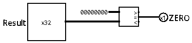

# Detector de Zero

O Detector de Zero é um componente interno à Unidade Lógica e Aritmética (ULA). Ele atua verificando se o resultado de 32 bits de uma operação matemática ou lógica calculada é igual a zero, emitindo um sinal booleano (`Zero`) de 1 bit que é fundamental para a tomada de decisões em desvios condicionais (*branches*).

 

## Interface

| Pino | Direção | Largura | Descrição |
| :--- | :---: | :---: | :--- |
| `Result` | Entrada | 32 bits | Resultado final da operação calculada pela ULA. |
| `Zero` | Saída | 1 bit | Sinalizador de resultado nulo (`1` para igual a zero, `0` caso contrário). |

 

## Funcionamento

O circuito realiza um teste simples de igualdade lógica de forma inteiramente combinacional:

*   **Resultado igual a zero (`Result == 0`):** quando todos os 32 bits da entrada `Result` estão em nível lógico baixo (`0`), a condição de igualdade é satisfeita e a saída `Zero` é ativada (`Zero = 1`).
*   **Resultado diferente de zero (`Result != 0`):** se pelo menos um dos 32 bits da entrada estiver em nível lógico alto (`1`), a comparação de igualdade falha e a saída é desativada (`Zero = 0`).

 

## Implementação

O circuito é projetado de maneira muito simples e rápida através de blocos combinacionais:
*   **Comparador:** bloco configurado para comparar a entrada de 32 bits `Result` com uma constante de valor `0` (`0x00000000`). Ele avalia se as duas entradas são iguais (`=`) e emite a resposta booleana correspondente diretamente ao pino de saída `Zero`.