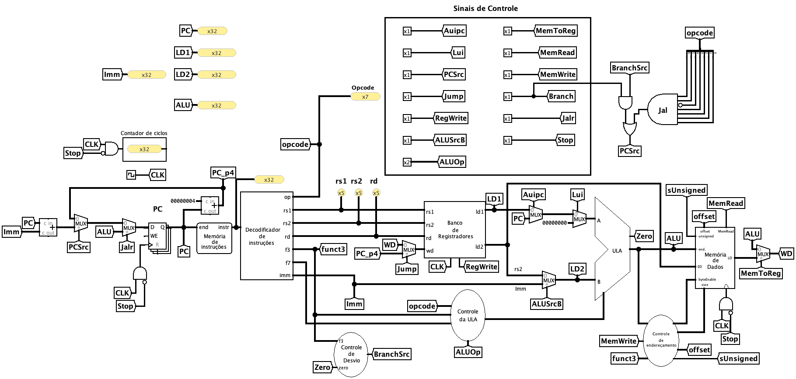

# Caminho de Dados Monociclo — Controle Manual



Variante didática do [caminho de dados monociclo](../../../datapaths/monociclo/README.md) em que a unidade de controle principal foi **removida** e seus sinais passaram a ser acionados manualmente por chaves. Todo o restante do circuito é idêntico ao original: mesmos componentes, mesmas ligações, mesmo comportamento.

O propósito é inverter a relação do discente com os sinais de controle. No monociclo comum, a `ucPrincipal` decide tudo a partir do `opcode` e o discente apenas observa o resultado. Aqui, cada instrução só executa corretamente se o discente determinar, ele próprio, a combinação de sinais que ela exige — e um sinal errado produz um resultado errado, visível no banco de registradores ou na memória de dados.

> [!IMPORTANTE]
> Este circuito é uma **cópia isolada**. A `ucPrincipal` é compartilhada com o caminho de dados com *pipeline*, e removê-la do componente de origem quebraria os dois modelos. Nada aqui deve ser editado a partir dos componentes originais.

<br>

## Diferenças em relação ao monociclo

| | Monociclo | Controle Manual |
| :--- | :--- | :--- |
| `ucPrincipal` | presente | removida |
| Sinais de controle | gerados a partir do `opcode` | acionados por chaves |
| `BranchSrc` | entrada interna da `ucPrincipal` | exibido em indicador de saída |
| `opcode` | consumido pela unidade de controle | apenas exibido, para leitura |
| Demais componentes | — | inalterados |

A `ucULA` **permanece no circuito**. Ela deriva a operação aritmética do `funct3`, do `funct7` e do `ALUOp`, e apenas este último é fornecido pelo discente. A seleção fina da operação continua automática.

<br>

## Interface

Doze chaves, totalizando treze bits, substituem as saídas da unidade removida.

| Chave | Bits | Efeito |
| :--- | :---: | :--- |
| `RegWrite` | 1 | Habilita a escrita no banco de registradores. |
| `ALUSrcB` | 1 | Seleciona o segundo operando da ULA (`0` = `rs2`, `1` = imediato). |
| `ALUOp` | 2 | Categoria da operação enviada à `ucULA` (`00` memória, `01` desvio, `10` lógico-aritmética). |
| `MemRead` | 1 | Habilita a leitura da memória de dados. |
| `MemWrite` | 1 | Habilita a escrita na memória de dados. |
| `MemToReg` | 1 | Origem do dado escrito no registrador (`0` = ULA, `1` = memória). |
| `Branch` | 1 | Identifica a instrução como desvio condicional. |
| `PCSrc` | 1 | Seleciona a origem do próximo `PC` (`0` = `PC+4`, `1` = alvo calculado). |
| `Jump` | 1 | Identifica um salto incondicional. |
| `S_Jalr` | 1 | Seleciona o comportamento específico do `jalr`. |
| `Auipc_uc` | 1 | Controle específico da instrução `auipc`. |
| `Lui_uc` | 1 | Controle específico da instrução `lui`. |
| `Stop` | 1 | Interrompe o processador. |

E dois indicadores somente de leitura:

| Indicador | Bits | Conteúdo |
| :--- | :---: | :--- |
| `opcode` | 7 | Campo `[6:0]` da instrução em execução. |
| `BranchSrc` | 1 | Condição de desvio avaliada pela `ucDesvio`. |

O `BranchSrc` é a peça que torna o exercício correto. Ele era **entrada** da unidade removida, não saída, e por isso não vira chave: continua sendo calculado pelo circuito a partir dos operandos. Sem exibi-lo, o discente não teria como decidir `PCSrc` em uma instrução de desvio — e, exibindo-o, fica claro que `Branch` e `PCSrc` são coisas distintas: a primeira declara que a instrução é um desvio, a segunda só pode ir a `1` se o próprio circuito disser que a condição se verificou.

<br>

## Como usar

### 1. Carregar o programa
Clique com o botão direito na **memória de instruções** &rarr; *Load Image* &rarr; selecione o arquivo `.txt` no formato `v2.0 raw`.

### 2. Zerar o estado
Antes de começar, garanta que o banco de registradores, a memória de dados e o contador de programa estão zerados. Use *Simulate* &rarr; *Reset Simulation* (`Ctrl+R`). Um estado residual de uma execução anterior produz divergências que não têm relação com os sinais acionados agora.

### 3. Executar um ciclo
A ordem importa, e é sempre a mesma:

1. Leia o `opcode` no indicador e identifique a instrução em execução.
2. Determine o valor de **todos** os treze bits — inclusive os que devem ficar em `0`.
3. Posicione as chaves e confira.
4. Só então acione o *clock* (`Ctrl+T` avança um ciclo).

> [!IMPORTANT]
> Não altere chaves com o *clock* em nível alto. Os sinais precisam estar estáveis durante todo o ciclo; alterá-los no meio produz escritas parciais e um estado que não corresponde a nenhuma combinação de controle.

### 4. Conferir e prosseguir
Verifique o efeito no banco de registradores, na memória de dados e no `PC` antes de avançar. Um erro não detectado se propaga: as instruções seguintes passam a operar sobre valores errados, e a causa fica cada vez mais distante do sintoma.

### 5. Reiniciar após um erro
Não há como desfazer um ciclo. Constatado um erro, anote o ciclo e o sinal responsável, reinicie a simulação (`Ctrl+R`) e execute novamente desde o início. Os programas da atividade são curtos justamente para que reiniciar custe pouco.

<br>

## Erros característicos

| Sintoma | Causa provável |
| :--- | :--- |
| O registrador de destino não muda | `RegWrite` em `0`. |
| O registrador recebe o valor errado, vindo da memória | `MemToReg` em `1` fora de um *load*. |
| A memória de dados é corrompida durante uma instrução aritmética | `MemWrite` em `1` indevidamente. |
| A ULA opera sobre `rs2` quando deveria usar o imediato | `ALUSrcB` em `0`. |
| O `PC` salta em um desvio que não deveria ser tomado | `PCSrc` em `1` sem conferir o `BranchSrc`. |
| O `PC` não salta em um `jal` | `PCSrc` em `0`; `Jump` sozinho não altera o `PC`. |
| O `jalr` salta para o alvo de um `jal` | `S_Jalr` em `0`. |
| A execução não para ao fim do programa | `Stop` em `0` na palavra `ffffffff`. |

<br>

## Verificação da montagem

Ao fim dos dez ciclos, o estado deve ser:

```
x1 = 00000005    x4 = 00001000    x7 = 00000000
x2 = 0000000A    x5 = 00000018    x8 = 00000028
x3 = 0000000A    x6 = 00000020    x9 = 00000000

mem[0x00] = 0000000A
```

As instruções em `0x20` e `0x28` não são executadas: a primeira é saltada pelo `jal`, a segunda pelo `jalr`. Por isso `x7` e `x9` permanecem em zero.

<br>

## Uso didático

Este circuito é o recurso central da atividade **E2 — Geração manual dos sinais de controle**.
