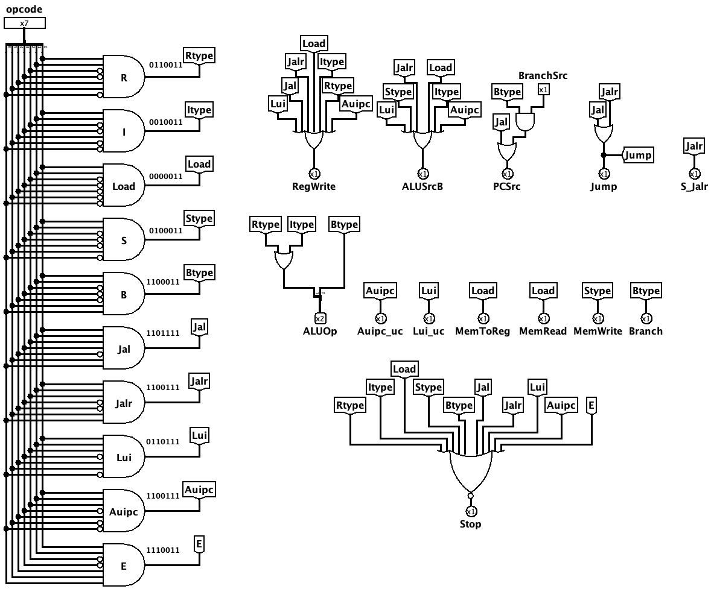

# Unidade de Controle Principal

A Unidade de Controle Principal é o "cérebro" do processador: a partir do campo `opcode` (7 bits) da instrução, ela identifica de qual tipo de instrução se trata e ativa os **sinais de controle** que coordenam todos os demais componentes do *datapath* (banco de registradores, ULA, memória de dados, multiplexadores e lógica de desvio). Ela também recebe o sinal `BranchSrc` (condição de desvio avaliada externamente) para decidir se um *branch* deve ser tomado.

Por ser puramente combinacional, ela não depende do clock: assim que o `opcode` se estabiliza, todos os sinais de controle correspondentes àquela instrução são gerados simultaneamente.

 

## Interface

| Pino | Direção | Largura | Descrição |
| :--- | :---: | :---: | :--- |
| `opcode` | Entrada | 7 bits | Campo `[6:0]` da instrução, que identifica seu formato e categoria. |
| `BranchSrc` | Entrada | 1 bit | Condição de desvio (vinda da unidade de desvio): indica se o *branch* deve ser tomado. |
| `RegWrite` | Saída | 1 bit | Habilita a escrita no banco de registradores. |
| `ALUSrcB` | Saída | 1 bit | Seleciona o segundo operando da ULA (`0` = registrador `rs2`, `1` = imediato). |
| `ALUOp` | Saída | 2 bits | Categoria da operação enviada à `ucULA` (`00` memória, `01` desvio, `10` lógico-aritmética). |
| `MemRead` | Saída | 1 bit | Habilita a leitura da memória de dados. |
| `MemWrite` | Saída | 1 bit | Habilita a escrita na memória de dados. |
| `MemToReg` | Saída | 1 bit | Seleciona a origem do dado escrito no registrador (`0` = ULA, `1` = memória). |
| `Branch` | Saída | 1 bit | Indica uma instrução de desvio condicional (*branch*). |
| `PCSrc` | Saída | 1 bit | Seleciona a origem do próximo PC (ativo em branch tomado ou salto). |
| `Jump` | Saída | 1 bit | Indica um salto incondicional (`jal`/`jalr`). |
| `S_Jalr` | Saída | 1 bit | Seleciona o comportamento específico do `jalr`. |
| `Auipc_uc` | Saída | 1 bit | Controle específico da instrução `auipc`. |
| `Lui_uc` | Saída | 1 bit | Controle específico da instrução `lui`. |
| `Stop` | Saída | 1 bit | Sinaliza a parada do processador (opcode inválido / fim do programa). |

 

## Tabela de decodificação do `opcode`

Cada categoria de instrução é reconhecida por um padrão único de `opcode`:

| Sinal interno | Opcode | Categoria / Exemplos |
| :--- | :---: | :--- |
| `Rtype` | `0110011` | Lógico-aritméticas registrador-registrador (`add`, `sub`, `and`, `or`…). |
| `Itype` | `0010011` | Lógico-aritméticas com imediato (`addi`, `ori`, `slli`…). |
| `Load` | `0000011` | Leitura da memória (`lw`, `lh`, `lb`, `lhu`, `lbu`). |
| `Stype` | `0100011` | Escrita na memória (`sw`, `sh`, `sb`). |
| `Btype` | `1100011` | Desvios condicionais (`beq`, `bne`, `blt`…). |
| `Jal` | `1101111` | Salto incondicional relativo (`jal`). |
| `Jalr` | `1100111` | Salto incondicional indireto (`jalr`). |
| `Lui` | `0110111` | Carregar imediato superior (`lui`). |
| `Auipc` | `0010111` | Somar imediato superior ao PC (`auipc`). |
| `E` | `1110011` | Instruções de sistema (`ecall`/`ebreak`). |

 

## Funcionamento

O circuito opera em dois estágios combinacionais:

### 1. Decodificação do `opcode`
O `opcode` de 7 bits é distribuído para um conjunto de portas `AND` (com inversores nas posições adequadas), uma para cada categoria da tabela acima. A porta correspondente ao padrão recebido produz `1`, gerando um sinal interno (`Rtype`, `Itype`, `Load`, etc.) que identifica a instrução atual.

 

### 2. Geração dos sinais de controle
Cada sinal de saída é formado por uma porta `OR` que combina os tipos de instrução que precisam ativá-lo. Os principais agrupamentos são:
*   **`RegWrite`** — ativo para todas as instruções que gravam em um registrador: `Rtype`, `Itype`, `Load`, `Jal`, `Jalr`, `Lui` e `Auipc`.
*   **`ALUSrcB`** — ativo quando o segundo operando vem de um imediato: `Itype`, `Load`, `Stype`, `Jalr`, `Lui` e `Auipc`.
*   **`ALUOp`** — formado por dois bits: `Rtype`/`Itype` selecionam `10` (lógico-aritmética) e `Btype` seleciona `01` (desvio); para `Load`/`Stype` permanece `00` (soma de endereço).
*   **`MemRead`** e **`MemToReg`** — ativos apenas para `Load`.
*   **`MemWrite`** — ativo apenas para `Stype`.
*   **`Branch`** — ativo para `Btype` (identifica a instrução como um desvio condicional).
*   **`PCSrc`** — ativo quando o próximo PC não é sequencial: ou em um **salto** (`Jal`/`Jalr`), ou em um **branch tomado**. Para o branch, uma porta `AND` combina `Btype` com a entrada `BranchSrc`, de modo que o desvio só altera o PC quando a condição avaliada externamente é verdadeira.
*   **`Jump`** = `Jal` OU `Jalr`; **`S_Jalr`** = `Jalr`.
*   **`Auipc_uc`** e **`Lui_uc`** — ativos exclusivamente para `Auipc` e `Lui`, respectivamente.

> [!NOTE]
> O sinal **`Stop`** é gerado por uma porta `NOR` de 10 entradas — uma para cada categoria de instrução reconhecida. Sua saída só vai para `1` quando **nenhuma** das categorias é satisfeita, ou seja, quando o `opcode` é inválido (por exemplo, ao buscar uma posição zerada da memória após o fim do programa), sinalizando que o processador deve parar.

 

## Implementação

O circuito é montado a partir dos seguintes blocos do Logisim:

- **Distribuidores (*splitters*):** fatiam o `opcode` de 7 bits para alimentar a lógica de decodificação e recombinam os bits do `ALUOp`.
- **Portas AND (decodificadores):** uma por categoria, com entradas negadas conforme o padrão, gerando os sinais internos de cada tipo de instrução.
- **Portas OR:** combinam os sinais de categoria para produzir cada sinal de controle de saída (`RegWrite`, `ALUSrcB`, `Jump`, `PCSrc`, etc.).
- **Porta AND (branch tomado):** combina `Btype` com a entrada `BranchSrc` para condicionar o `PCSrc`.
- **Porta NOR:** reúne as 10 categorias para gerar o sinal `Stop` na ausência de instrução válida.
