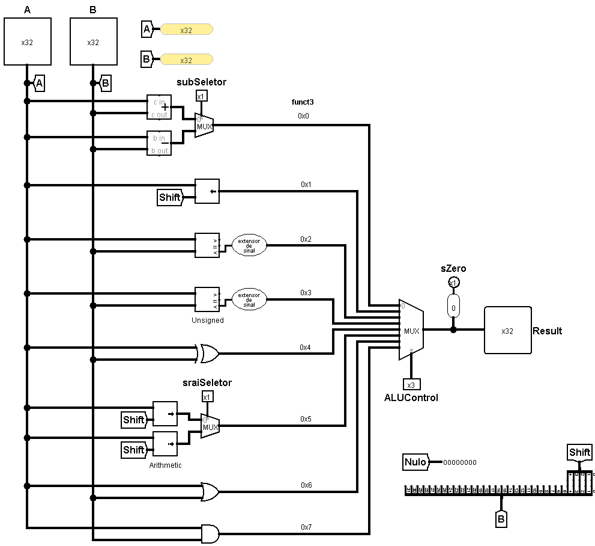

# Unidade Lógica e Aritmética (ULA)

A Unidade Lógica e Aritmética (`ULA`) é o componente que executa as operações aritméticas e lógicas do processador. A cada ciclo ela recebe dois operandos de 32 bits (`A` e `B`) e um código de controle (`ALUControl`), que seleciona qual operação será realizada, produzindo o resultado em `Result` e a flag `sZero`.

O `ALUControl` tem **3 bits e é o próprio `funct3`** da instrução: o multiplexador de saída da ULA está organizado exatamente na ordem dos `funct3` do bloco `OP`/`OP-IMM` do RISC-V (`000` = `add`/`sub`, `001` = `sll`, `010` = `slt`, …, `111` = `and`). Como o `funct3` sozinho não distingue os dois pares ambíguos do ISA (`add`/`sub` e `srl`/`sra`), a ULA recebe duas entradas auxiliares de 1 bit — **`subSeletor`** e **`sraiSeletor`** — que desempatam cada um desses grupos.

É utilizada para três finalidades principais:
*   **Operações lógico-aritméticas** das instruções Tipo R e Tipo I (`add`, `sub`, `and`, `or`, `xor`, deslocamentos e comparações).
*   **Cálculo de endereço** das instruções de memória (`lw`/`sw`), somando a base ao valor imediato.
*   **Avaliação das condições de desvio** (`beq`, `bne`, `blt`, `bge`, `bltu`, `bgeu`), em conjunto com a flag `sZero` e a unidade de desvio (`ucDesvio`).

 

## Interface

| Pino | Direção | Largura | Descrição |
| :--- | :---: | :---: | :--- |
| `A` | Entrada | 32 bits | Primeiro operando (geralmente `rs1`). |
| `B` | Entrada | 32 bits | Segundo operando (`rs2` ou valor imediato). |
| `ALUControl` | Entrada | 3 bits | Código que seleciona a operação executada — corresponde ao `funct3` (ver tabela). |
| `subSeletor` | Entrada | 1 bit | Desempata o grupo `000`: `0` = soma (`add`), `1` = subtração (`sub`). |
| `sraiSeletor` | Entrada | 1 bit | Desempata o grupo `101`: `0` = deslocamento lógico (`srl`), `1` = deslocamento aritmético (`sra`). |
| `Result` | Saída | 32 bits | Resultado da operação selecionada. |
| `sZero` | Saída | 1 bit | Sinalizador de resultado nulo (`1` quando `Result == 0`). |

Os três sinais de controle (`ALUControl`, `subSeletor` e `sraiSeletor`) são gerados pelo controlador [`ucULA`](../ucULA/README.md), a partir do `ALUOp` (vindo da unidade de controle principal) e dos campos `opcode`, `funct3` e `funct7` da instrução.

 

## Tabela de operações (`ALUControl`)

| `ALUControl` (`funct3`) | Seletor auxiliar | Operação | Instruções |
| :---: | :---: | :--- | :--- |
| `000` | `subSeletor = 0` | Soma (`A + B`) | `add`, `addi`, e endereço de `lw`/`sw` |
| `000` | `subSeletor = 1` | Subtração (`A - B`) | `sub`, e `beq`/`bne` (via `sZero`) |
| `001` | — | Deslocamento à esquerda | `sll`, `slli` |
| `010` | — | Menor-que com sinal | `slt`, `slti`, `blt`, `bge` |
| `011` | — | Menor-que sem sinal | `sltu`, `sltiu`, `bltu`, `bgeu` |
| `100` | — | XOR lógico | `xor`, `xori` |
| `101` | `sraiSeletor = 0` | Deslocamento à direita lógico | `srl`, `srli` |
| `101` | `sraiSeletor = 1` | Deslocamento à direita aritmético | `sra`, `srai` |
| `110` | — | OR lógico | `or`, `ori` |
| `111` | — | AND lógico | `and`, `andi` |

> [!NOTE]
> Como o seletor é o próprio `funct3`, **todos os oito códigos possíveis estão em uso** e o multiplexador de saída não tem entradas ociosas. Não existe mais nenhum código "não usado" na ULA — o que havia no formato anterior, de 4 bits.

 

## Funcionamento

A ULA é **puramente combinacional**: ela calcula **todas** as operações em paralelo e, no final, um **multiplexador de 8 entradas** escolhe qual resultado sai em `Result`, usando o `ALUControl` (3 bits) como seletor.

Antes desse multiplexador final existem dois **multiplexadores de desempate**, de 2 entradas cada, que resolvem os pares ambíguos do `funct3` antes de o resultado chegar à entrada correspondente do mux principal:

*   Entrada `000` ← mux entre **somador** e **subtrator**, selecionado por `subSeletor`.
*   Entrada `101` ← mux entre **deslocador lógico à direita** e **deslocador aritmético à direita**, selecionado por `sraiSeletor`.

### 1. Quantidade de deslocamento
Os três deslocadores não usam `B` inteiro: um distribuidor extrai os **5 bits menos significativos de `B`** (`B[4:0]`, sinal interno `Shift`), conforme exige o RISC-V de 32 bits. Assim, um deslocamento de `33` posições equivale a um deslocamento de `1`.

### 2. Apoio aos desvios (*branches*)
A ULA não decide o desvio sozinha, mas fornece as comparações que a `ucDesvio` usa:
*   `beq`/`bne` usam a **subtração** (`000` com `subSeletor = 1`): se `A - B == 0`, então `A == B`, e a flag `sZero` sinaliza a igualdade.
*   `blt`/`bge` usam o **menor-que com sinal** (`010`).
*   `bltu`/`bgeu` usam o **menor-que sem sinal** (`011`).

 

## Implementação

Internamente, cada operação possui um bloco dedicado, e a saída de todos eles converge para o multiplexador final:

*   **Somador (`Adder`)** e **subtrator (`Subtractor`)** — calculam `A + B` e `A - B`; um mux de 2 entradas controlado por `subSeletor` entrega um dos dois à entrada `000`.
*   **Portas lógicas** — `XOR` (`100`), `OR` (`110`) e `AND` (`111`), bit a bit.
*   **Deslocadores (`Shifter`)** — três unidades: à esquerda (`001`), à direita lógica e à direita aritmética; as duas últimas passam pelo mux controlado por `sraiSeletor` antes de alimentar a entrada `101`.
*   **Comparadores (`Comparator`)** — dois no total: um com sinal (`010`) e um sem sinal (`011`), ambos usando a saída *menor-que*. Cada comparador passa por um **extensor de sinal**, que transforma o resultado de 1 bit em 32 bits antes de entrar no mux.

A flag **`sZero`** é produzida pelo subcomponente **`zero`**, que verifica se todos os 32 bits do `Result` estão em nível baixo. É justamente isso que permite às instruções `beq`/`bne` decidirem a igualdade a partir da subtração.
