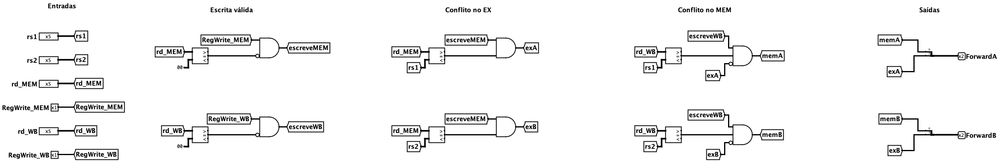

# Unidade de Encaminhamento (ucEncaminhamento)



A Unidade de Encaminhamento (`ucEncaminhamento`) é a _forwarding unit_ descrita por Patterson e Hennessy. Ela detecta quando uma instrução vai ler um registrador que ainda está sendo calculado por uma instrução mais adiante no _pipeline_ e escolhe de onde o valor correto deve vir: do banco de registradores, do registrador `EX/MEM` ou do registrador `MEM/WB`.

Sem ela, uma instrução que lê um registrador escrito logo antes enxerga o valor **antigo**, e o programa precisa de bolhas (`nop`) entre as duas. Com ela, o valor novo é **encaminhado** direto do estágio em que já existe, e essas bolhas deixam de ser necessárias.

A unidade é puramente combinacional e não sabe em qual estágio está: as entradas `rs1` e `rs2` são os registradores lidos pela instrução que ela protege. No [`pipelineEncaminhamento`](../../../datapaths/pipelineEncaminhamento/) ela é usada **duas vezes**, uma para o estágio EX (ULA, endereços e dado do _store_) e outra para o estágio ID (comparação dos desvios).

<br>

## Interface

| Pino | Direção | Largura | Descrição |
| :--- | :---: | :---: | :--- |
| `rs1` | Entrada | 5 bits | Primeiro registrador lido pela instrução protegida. |
| `rs2` | Entrada | 5 bits | Segundo registrador lido pela instrução protegida. |
| `RegWrite_MEM` | Entrada | 1 bit | Indica se a instrução no MEM escreve no banco. |
| `rd_MEM` | Entrada | 5 bits | Registrador de destino da instrução no estágio MEM (saída do `EX/MEM`). |
| `RegWrite_WB` | Entrada | 1 bit | Indica se a instrução no WB escreve no banco. |
| `rd_WB` | Entrada | 5 bits | Registrador de destino da instrução no estágio WB (saída do `MEM/WB`). |
| `ForwardA` | Saída | 2 bits | Seletor do MUX de encaminhamento de `rs1`. |
| `ForwardB` | Saída | 2 bits | Seletor do MUX de encaminhamento de `rs2`. |

O bloco é um retângulo com o nome de cada porta escrito ao lado dela: as seis entradas ficam na borda esquerda, de cima para baixo na ordem da tabela, e as duas saídas na borda direita (`ForwardA` acima de `ForwardB`).

<br>

## Funcionamento

### Codificação das saídas
Os seletores seguem a mesma codificação do livro:

| `ForwardA` / `ForwardB` | Origem do valor | Quando |
| :---: | :--- | :--- |
| `00` | Banco de registradores | Nenhuma instrução adiante escreve no registrador lido. |
| `10` | `EX/MEM` | A instrução **imediatamente anterior** escreve no registrador lido. |
| `01` | `MEM/WB` | A instrução de **duas posições antes** escreve no registrador lido. |

A combinação `11` nunca é gerada, então a entrada `3` dos MUXes de encaminhamento nunca é selecionada.

### Condições
Para `rs1` (a lógica de `rs2` é idêntica, trocando `rs1` por `rs2` e `ForwardA` por `ForwardB`):

```
Conflito no EX:   RegWrite_MEM  e  rd_MEM ≠ 0  e  rd_MEM = rs1                          ->  ForwardA = 10
Conflito no MEM:  RegWrite_WB   e  rd_WB  ≠ 0  e  rd_WB  = rs1  e  não (Conflito no EX)  ->  ForwardA = 01
```

Cada termo existe por um motivo:

| Termo | Por quê |
| :--- | :--- |
| `RegWrite` | _Stores_ e desvios têm um campo na posição do `rd`, mas ali estão bits do imediato. Sem `RegWrite`, um `sw` cujo imediato coincidisse com o registrador lido desviaria o endereço da memória para a ULA. |
| `rd ≠ 0` | O `x0` vale sempre `0`. Uma instrução como `addi x0, x0, 99` tem `RegWrite = 1`, mas o valor calculado **nunca** pode ser encaminhado. |
| `não (Conflito no EX)` | Se as instruções no MEM e no WB escrevem no mesmo registrador, vale a **mais recente** (a do MEM), como em `addi x3, x0, 1` seguido de `addi x3, x0, 2` e `add x5, x3, x3`. |

> [!NOTE]
> Uma instrução no WB e outra no ID, no mesmo ciclo, não precisam de encaminhamento no banco: ele grava na primeira metade do ciclo e o `ID/EX` captura a leitura na segunda (ver [Bordas de _clock_](../../../datapaths/pipeline/README.md#bordas-de-clock)). Por isso a unidade só olha os estágios MEM e WB.

### O que ela não resolve
A unidade escolhe a **origem** do valor, mas não consegue criar um valor que ainda não existe:

- Um _load_ no MEM ainda não leu a memória: o `EX/MEM` guarda só o endereço. A instrução seguinte precisa de uma bolha.
- Um desvio resolvido no ID compara os operandos no mesmo ciclo em que a instrução anterior ainda está na ULA. Por isso a instância do ID precisa de uma bolha entre a escrita e o desvio (duas, se a escrita for um _load_).

Inserir essas bolhas em hardware é o papel da unidade de detecção de bolhas; sem ela, o programa precisa trazer o `nop`.

<br>

## Implementação

A `ucEncaminhamento` é construída pelos seguintes blocos, organizados em colunas no circuito:

- **Entradas** — seis pinos, cada um ligado a um túnel de mesmo nome.
- **Escrita válida** — dois **Comparadores** de 5 bits comparam `rd_MEM` e `rd_WB` com a constante `0`; duas portas **AND** com a saída `=` negada formam `escreveMEM` (`RegWrite_MEM` e `rd_MEM ≠ 0`) e `escreveWB`.
- **Conflito no EX** — dois **Comparadores** de 5 bits (`rd_MEM = rs1` e `rd_MEM = rs2`) e duas portas **AND** com `escreveMEM` geram `exA` e `exB`.
- **Conflito no MEM** — dois **Comparadores** de 5 bits (`rd_WB = rs1` e `rd_WB = rs2`) e duas portas **AND** de 3 entradas com `escreveWB` e a condição do EX negada geram `memA` e `memB`.
- **Saídas** — dois **Splitters** de 2 bits juntam os sinais em `ForwardA = {exA, memA}` e `ForwardB = {exB, memB}` (bit 1 = `EX/MEM`, bit 0 = `MEM/WB`).

A aparência do bloco é um retângulo de cantos arredondados com o título e o nome de cada porta, com as portas espaçadas de 30 em 30.
