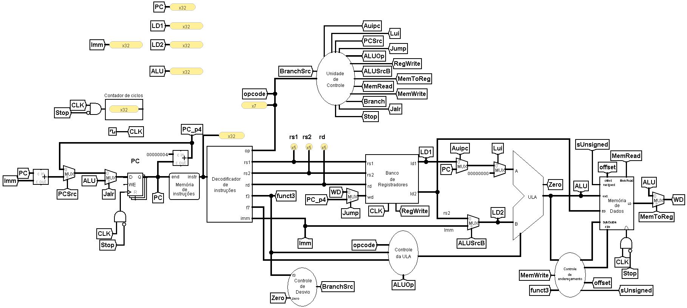

# Datapath - Monociclo

Implementação do processador RISC-V em **ciclo único** (_single-cycle_): cada instrução é buscada, decodificada, executada, acessa a memória e escreve o resultado dentro de um único ciclo de _clock_. Só quando tudo isso termina é que a borda do _clock_ atualiza o `PC` e a próxima instrução começa.
