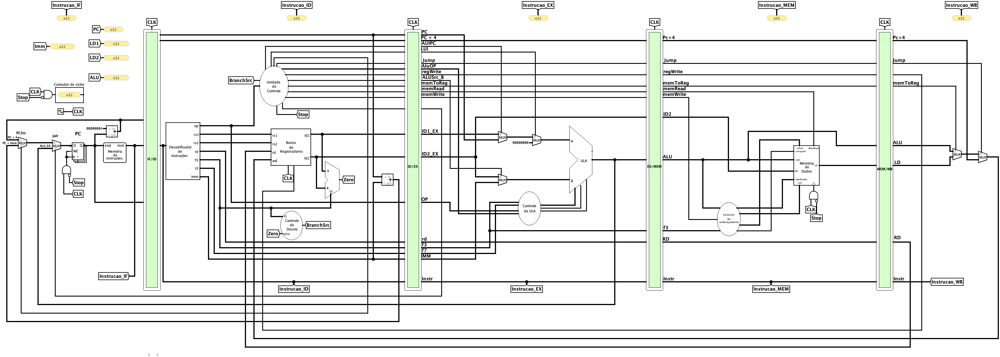

# Datapath — Pipeline



Implementação do processador RISC-V com **pipeline de 5 estágios**. Em vez de
executar uma instrução por completo antes de buscar a próxima (como no
[monociclo](../monociclo/)), a execução é dividida em cinco etapas que operam
**simultaneamente**, cada uma trabalhando em uma instrução diferente. Isso
aumenta a vazão (instruções concluídas por unidade de tempo).

Os cinco estágios são separados por **registradores de estágio** (as barreiras
verdes no circuito), que capturam, na subida do _clock_, os dados e sinais de
controle de um estágio e os entregam de forma estável ao estágio seguinte.

Os desvios condicionais (`beq`, `bne`, `blt`, `bge`, `bltu`, `bgeu`) são resolvidos já no 
estágio **ID**, operando diretamente sobre as saídas do banco de
registradores. Isso reduz a penalidade de desvio para **1 bolha**.

<br>

## Visão geral dos estágios

| Estágio | Nome | Função | Registrador de saída |
| :---: | :--- | :--- | :---: |
| **IF** | _Instruction Fetch_ | Busca a instrução na memória e calcula o próximo `PC` | `IF/ID` |
| **ID** | _Instruction Decode_ | Decodifica, lê o banco de registradores e **resolve os desvios** | `ID/EX` |
| **EX** | _Execute_ | Executa a operação na ULA (aritmética, endereço, alvo do `jalr`) | `EX/MEM` |
| **MEM** | _Memory_ | Acessa a memória de dados (`lw`/`sw` e variantes) | `MEM/WB` |
| **WB** | _Write-Back_ | Escreve o resultado de volta no banco de registradores | — |

<br>

## Estágio IF — Busca da Instrução

Responsável por buscar a instrução apontada pelo `PC` e determinar o endereço da
próxima.

- **Registrador `PC`** — guarda o endereço da instrução atual. Sua atualização é
  condicionada pelo sinal `Stop`: quando `Stop = 1` (opcode inválido), o `PC`
  **congela** e a execução para.
- **Somador `PC + 4`** — soma a constante `4` ao `PC` para obter o endereço
  sequencial da próxima instrução ([`Adder`](../../componentes/)).
- **[Memória de instruções](../../componentes/memInstrucoes/)** — ROM que devolve
  a instrução de 32 bits armazenada no endereço `PC`.
- **MUX `PCSrc`** — escolhe a origem do próximo `PC`: `PC + 4` (sequencial) ou
  `PC + Imm` (alvo do desvio/`jal`). O seletor `PCSrc` vem da `ucPrincipal`.
- **MUX `Jalr`** — sobrepõe o resultado anterior com o alvo do `jalr`
  (`ALU_EX` = `rs1 + imm`, calculado pela ULA no estágio EX).
- **[Contador de ciclos](../../componentes/contadorCiclos/)** — conta os ciclos
  executados; seu _clock_ também é interrompido pelo `Stop`.

<br>

## Estágio ID — Decodificação e resolução de desvios

O estágio mais denso: decodifica a instrução, lê os operandos e decide os
desvios.

- **[Decodificador de instruções](../../componentes/decodificador/)** — fatia a
  instrução em `op`, `rs1`, `rs2`, `rd`, `funct3`, `funct7` e gera o imediato
  (`imm`) já estendido.
- **[Unidade de Controle (`ucPrincipal`)](../../componentes/ucPrincipal/)** — a
  partir do `opcode` (e do `BranchSrc`), gera todos os sinais de controle:
  `Jump`, `ALUOp`, `RegWrite`, `ALUSrcB`, `MemToReg`, `MemRead`, `MemWrite`,
  `Auipc`, `Lui`, `Jalr`, **`PCSrc`** e `Stop`.
- **[Banco de Registradores](../../componentes/bancoRegistradores/)** — lê `rs1`
  e `rs2` (saídas `ld1`/`ld2`) e escreve `rd` na fase WB (borda de _clock_).
- **[Mini-ULA de desvio (`idULA`)](../../componentes/pipelineComponentes/idULA/)**
  — recebe `A = rs1`, `B = rs2` e `funct3`; faz as comparações necessárias e
  entrega o sinal **`Zero`**. Substitui, para os desvios, o par `ucULA + ULA` do
  estágio EX.
- **[Controle de Desvio (`ucDesvio`)](../../componentes/ucDesvio/)** — recebe
  `Zero` (da `idULA`) e `funct3` e produz **`BranchSrc`**, que sobe até a
  `ucPrincipal` para formar o `PCSrc`.
- **Somador do alvo (`PC + Imm`)** — calcula o endereço de destino do desvio,
  roteado ao MUX `PCSrc` do estágio IF.

<br>

## Estágio EX — Execução

Realiza a operação aritmética/lógica principal.

- **MUXes de operando** — selecionam as entradas `A` e `B` da ULA:
  - `A`: `rs1`, ou o `PC` (para `auipc`), ou `0` (para `lui`).
  - `B`: `rs2` ou o imediato (`IMM`), conforme o sinal `ALUSrcB`.
- **[ULA](../../componentes/ULA/)** — executa a operação (soma, subtração,
  lógicas, deslocamentos, comparações) e calcula endereços de `load`/`store` e o
  alvo do `jalr` (`rs1 + imm`).
- **[Controle da ULA (`ucULA`)](../../componentes/ucULA/)** — decodifica `ALUOp`,
  `opcode`, `funct3` e `funct7` no `ALUControl` de 3 bits (na ordem do `funct3`) e
  nos dois seletores de desempate da ULA, `subSeletor` (`add`/`sub`) e
  `sraiSeletor` (`srl`/`sra`).

<br>

## Estágio MEM — Acesso à Memória

Executa as instruções de `load` e `store`.

- **[Memória de Dados](../../componentes/memDados/)** — usa o resultado da ULA
  como endereço (`end.`) e `rs2` como dado a gravar (`ED`). Suporta acessos de
  _byte_, _half_ e _word_, com/sem sinal.
- **[Controle de endereçamento (`ucEnderecamento`)](../../componentes/ucEnderecamento/)**
  — a partir de `funct3` e do endereço, gera `byteEnable`, `size`, `offset` e
  `unsigned`, permitindo `sb`/`sh`/`sw` e `lb`/`lh`/`lw`/`lbu`/`lhu`.
- O _clock_ de escrita da memória também é interrompido pelo `Stop`.

<br>

## Estágio WB — Escrita no Registrador

Decide qual valor volta ao banco de registradores.

- **MUX `MemToReg`** — escolhe entre o resultado da ULA e o dado lido da memória
  (`LD`).
- **MUX `Jump`** — sobrepõe com `PC + 4` (endereço de retorno de `jal`/`jalr`).
- O valor final entra em `wd`, com `rd` como endereço de escrita e `RegWrite`
  como habilitação.

<br>

## Resolução de desvios no estágio ID

Este é o ponto central da arquitetura (issue #82). O caminho do desvio é:

```
rs1, rs2 ─► idULA (+ funct3) ─► Zero ─► ucDesvio (+ funct3) ─► BranchSrc ─► ucPrincipal ─► PCSrc ─► MUX (IF)
                                                                    PC + Imm ─────────────────────► MUX (IF)
```

- A **`idULA`** compara `rs1` e `rs2` (igualdade, menor-que com e sem sinal) e
  entrega um único `Zero`, no significado que o `funct3` seleciona.
- O **`ucDesvio`** aplica a polaridade correta e emite `BranchSrc`.
- A **`ucPrincipal`** combina `BranchSrc` com o tipo da instrução para gerar
  `PCSrc`, que no IF seleciona `PC + Imm` como próximo `PC`.

Como tudo isso acontece no **ID**, o desvio é decidido um estágio antes do que
seria no EX — reduzindo a penalidade para **1 bolha** (a instrução buscada logo
atrás do desvio é descartada quando ele é tomado).

> O **`jalr`** é a exceção: seu alvo (`rs1 + imm`) depende da ULA, então é
> resolvido no **EX** e realimentado ao `PC` pelo MUX `Jalr` (`ALU_EX`).

<br>

## Sinal `Stop`

Gerado pela `ucPrincipal` quando o `opcode` é inválido (por exemplo, ao buscar a
palavra `0xFFFFFFFF` que marca o fim do programa). O `Stop` **congela o `PC`** e
interrompe o _clock_ da memória de dados e do contador de ciclos, encerrando a
execução de forma limpa.

<br>

## Registradores de estágio

Cada barreira propaga apenas o que os estágios seguintes ainda vão consumir:

| Registrador | Dados propagados | Controle propagado |
| :--- | :--- | :--- |
| **[IF/ID](../../componentes/estagiosPipeline/estagioIF_ID/)** | instrução, `PC`, `PC+4` | — |
| **[ID/EX](../../componentes/estagiosPipeline/estagioID_EX/)** | `rs1`, `rs2`, `imm`, `PC`, `PC+4`, `rd`, `funct3`, `funct7` | `ALUOp`, `ALUSrcB`, `Auipc`, `Lui`, `Jump`, `RegWrite`, `MemToReg`, `MemRead`, `MemWrite` |
| **[EX/MEM](../../componentes/estagiosPipeline/estagioEX_MEM/)** | resultado da ULA, `rs2`, `rd`, `PC+4`, `funct3` | `MemRead`, `MemWrite`, `RegWrite`, `MemToReg`, `Jump` |
| **[MEM/WB](../../componentes/estagiosPipeline/estagioMEM_WB/)** | dado da memória (`LD`), resultado da ULA, `rd`, `PC+4` | `RegWrite`, `MemToReg`, `Jump` |

Os sinais resolvidos no EX (`ALUSrcB`, `ALUOp`, `Auipc`, `Lui`, `Jalr`,
`BranchSrc`) **não** atravessam o `EX/MEM` — são consumidos antes.

<br>

## Conflitos e bolhas

Este _datapath_ **não** possui _forwarding_ nem detecção de _hazard_ em hardware.
A resolução de conflitos de dados é feita por **bolhas manuais** (`nop`)
inseridas no código: são necessários **3 NOPs** entre uma instrução que escreve
um registrador e outra que o lê. Os programas de teste em
[`codigos/`](../../codigos/) seguem essa convenção.

<br>

## Arquivo

- **`main.circ`** — circuito completo do _datapath_ pipeline (abrir no
  Logisim-Evolution).
