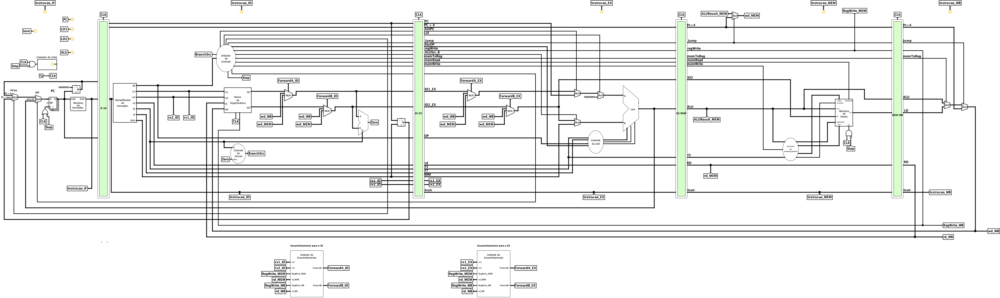

# Datapath — Pipeline com Encaminhamento



Versão do [pipeline simples](../pipeline/) que resolve os conflitos de dados em **hardware**, por encaminhamento (_forwarding_), como descrito por Patterson e Hennessy. Os cinco estágios, os registradores de estágio, as [bordas de _clock_](../pipeline/README.md#bordas-de-clock) e a resolução dos desvios no ID são os mesmos do pipeline simples; este manual descreve só o que foi acrescentado.

No pipeline simples, uma instrução que lê um registrador escrito por uma das duas instruções anteriores enxerga o valor **antigo**, e o programa precisa de 2 `nop` entre elas. Aqui, a [Unidade de Encaminhamento](../../componentes/pipelineComponentes/ucEncaminhamento/) percebe a dependência e um MUX entrega o valor novo, tirado do estágio em que ele já foi calculado.

<br>

## O que muda em relação ao pipeline simples

| Acréscimo | Estágio | Função |
| :--- | :---: | :--- |
| [`ucEncaminhamento`](../../componentes/pipelineComponentes/ucEncaminhamento/) (EX) | EX | Gera `ForwardA_EX`/`ForwardB_EX` a partir de `rs1_EX`, `rs2_EX` e do `rd` das instruções no MEM e no WB. |
| MUXes `ForwardA_EX` e `ForwardB_EX` | EX | Escolhem os operandos da ULA e o dado do _store_. |
| [`ucEncaminhamento`](../../componentes/pipelineComponentes/ucEncaminhamento/) (ID) | ID | Gera `ForwardA_ID`/`ForwardB_ID` a partir de `rs1_ID` e `rs2_ID`. |
| MUXes `ForwardA_ID` e `ForwardB_ID` | ID | Escolhem os operandos da `idULA`, que decide os desvios. |
| MUX `wd_MEM` | MEM | Monta o valor que a instrução no MEM vai escrever: resultado da ULA ou `PC + 4`. |
| `rs1` e `rs2` no [`ID/EX`](../../componentes/estagiosPipeline/estagioID_EX/) | ID &rarr; EX | Levam ao EX os números dos registradores lidos. |

As duas unidades são o **mesmo** componente: ele não sabe em qual estágio está, só compara os registradores lidos com o `rd` das instruções no MEM e no WB.

<br>

## Valores encaminhados

Todos os MUXes de encaminhamento usam a codificação do livro, com as mesmas três origens:

| Seletor | Entrada do MUX | Túnel | Valor |
| :---: | :---: | :--- | :--- |
| `00` | 0 | — | Valor lido do banco (ID) ou guardado no `ID/EX` (EX). |
| `01` | 1 | `wd_WB` | Valor que o WB está escrevendo no banco (saída do MUX `Jump` do WB). |
| `10` | 2 | `wd_MEM` | Valor que a instrução no MEM vai escrever. |
| `11` | 3 | — | Nunca gerado; a entrada fica desconectada. |

### Por que `wd_MEM` e não só o resultado da ULA
No livro, o valor encaminhado do `EX/MEM` é o resultado da ULA. Aqui isso não basta: `jal` e `jalr` escrevem `PC + 4` no `rd`, e não o que está na ULA. O MUX `wd_MEM` repete no MEM a escolha que o MUX `Jump` faz no WB:

```
ALUResult_MEM ─► 0 ┐
                   MUX ─► wd_MEM
    PC + 4_MEM ─► 1 ┘
                   ▲
               Jump_MEM
```

Assim, uma instrução que usa o endereço de retorno logo depois de um salto recebe o valor certo.

> [!IMPORTANT]
> Um _load_ no MEM ainda não leu a memória: `wd_MEM` é o endereço, e não o dado. A instrução seguinte a um _load_ que use o registrador lido **precisa** de uma bolha. Ver [Conflitos e bolhas](#conflitos-e-bolhas).

<br>

## Encaminhamento no EX

É o encaminhamento clássico do livro. Os MUXes ficam logo na saída do `ID/EX`, **antes** dos MUXes que já existiam:

```
ld1_EX ─► MUX ForwardA_EX ─► MUX Auipc ─► MUX Lui ─► ULA (A)
ld2_EX ─► MUX ForwardB_EX ─┬─► MUX ALUSrcB ────────► ULA (B)
                           └─► EX/MEM (dado do store)
```

- Como o MUX `ForwardA_EX` vem antes de `Auipc` e `Lui`, essas instruções continuam recebendo o `PC` e o `0`, mesmo que o campo `rs1` (que nelas é parte do imediato) coincida com o `rd` de uma instrução anterior.
- Pelo mesmo motivo, o MUX `ALUSrcB` continua escolhendo o imediato nas instruções do tipo I.
- A saída do MUX `ForwardB_EX` também vai para o `EX/MEM`: um `sw` que grava um registrador recém-calculado grava o valor novo.
- O alvo do `jalr` sai da ULA, então a base do `jalr` também é encaminhada.

<br>

## Encaminhamento no ID

Os desvios são resolvidos no ID pela [`idULA`](../../componentes/pipelineComponentes/idULA/), que compara os valores lidos do banco. Patterson e Hennessy observam que antecipar o desvio para o ID exige uma **nova** lógica de encaminhamento para essa comparação, com valores vindos do `EX/MEM` e do `MEM/WB`. Por isso a unidade é instanciada uma segunda vez, com `rs1_ID` e `rs2_ID`.

Os MUXes `ForwardA_ID` e `ForwardB_ID` ficam na **saída do banco**, então o valor escolhido alimenta a `idULA` e também o `ID/EX`:

```
ld1 (banco) ─► MUX ForwardA_ID ─┬─► idULA (A)
                                └─► ID/EX
ld2 (banco) ─► MUX ForwardB_ID ─┬─► idULA (B)
                                └─► ID/EX
```

Mandar o valor encaminhado para o `ID/EX` não muda nenhum resultado: se ele estiver desatualizado (por exemplo, o endereço de um _load_), a unidade do EX corrige no ciclo seguinte, quando a mesma instrução estiver no `MEM/WB`.

> [!NOTE]
> A entrada `01` (`wd_WB`) no ID devolve o mesmo valor que o banco já entregaria, porque o banco grava na primeira metade do ciclo. Ela existe só porque a unidade é a mesma nos dois estágios.

<br>

## Sinais novos

| Túnel | Largura | Origem | Destino |
| :--- | :---: | :--- | :--- |
| `rs1_ID`, `rs2_ID` | 5 bits | Saídas `rs1`/`rs2` do decodificador | `ID/EX` e unidade do ID |
| `rs1_EX`, `rs2_EX` | 5 bits | Saídas do `ID/EX` | Unidade do EX |
| `rd_MEM`, `RegWrite_MEM` | 5 / 1 bits | Saídas do `EX/MEM` | As duas unidades |
| `rd_WB`, `RegWrite_WB` | 5 / 1 bits | Saídas do `MEM/WB` | As duas unidades |
| `ALUResult_MEM` | 32 bits | Resultado da ULA na saída do `EX/MEM` | MUX `wd_MEM` |
| `wd_MEM` | 32 bits | MUX `wd_MEM` | Entrada 2 dos quatro MUXes de encaminhamento |
| `wd_WB` | 32 bits | MUX `Jump` do WB (entrada `wd` do banco) | Entrada 1 dos quatro MUXes de encaminhamento |
| `ForwardA_ID`, `ForwardB_ID` | 2 bits | Unidade do ID | MUXes na saída do banco |
| `ForwardA_EX`, `ForwardB_EX` | 2 bits | Unidade do EX | MUXes na saída do `ID/EX` |

As duas unidades ficam na parte de baixo do circuito, abaixo dos estágios que protegem, ligadas só por túneis.

<br>

## Conflitos e bolhas

O encaminhamento elimina a maior parte das bolhas de dados, mas não todas. Os casos que sobram são os mesmos que o livro resolve **parando** o _pipeline_, papel de uma unidade de detecção de bolhas, que este _datapath_ ainda não tem. Até lá, o programa precisa trazer os `nop`:

| Quem lê o registrador | Quem escreveu | Pipeline simples | Pipeline com encaminhamento |
| :--- | :--- | :---: | :---: |
| ULA, base de _load_/_store_, dado do _store_, base do `jalr` | qualquer instrução, exceto _load_ | 2 `nop` | **nenhum** |
| ULA, base de _load_/_store_, dado do _store_, base do `jalr` | _load_ | 2 `nop` | **1** `nop` |
| Desvio condicional (ID) | qualquer instrução, exceto _load_ | 2 `nop` | **1** `nop` |
| Desvio condicional (ID) | _load_ | 2 `nop` | **2** `nop` |

- **_Load_ &rarr; uso:** o dado só existe no fim do MEM; na instrução seguinte ele ainda não pode ser encaminhado.
- **Escrita &rarr; desvio:** o desvio é decidido no ID no mesmo ciclo em que a instrução anterior ainda está na ULA.
- **_Load_ &rarr; desvio:** junta os dois atrasos.

As bolhas de **controle** não mudam: o tratamento dos desvios e saltos é o mesmo do pipeline simples.

Os programas escritos para o pipeline simples continuam funcionando aqui: um `nop` a mais só custa um ciclo.

<br>

## Teste

O programa [`teste_encaminhamento`](../../codigos/teste_encaminhamento/) exercita cada caminho de encaminhamento sem bolhas desnecessárias e confere sozinho os resultados (`x31 = 1`). No pipeline simples, o mesmo programa termina com `x31 = 0`.

<br>

## Arquivo

- **`main.circ`** — circuito completo do _datapath_ pipeline com encaminhamento (abrir no Logisim-Evolution).
